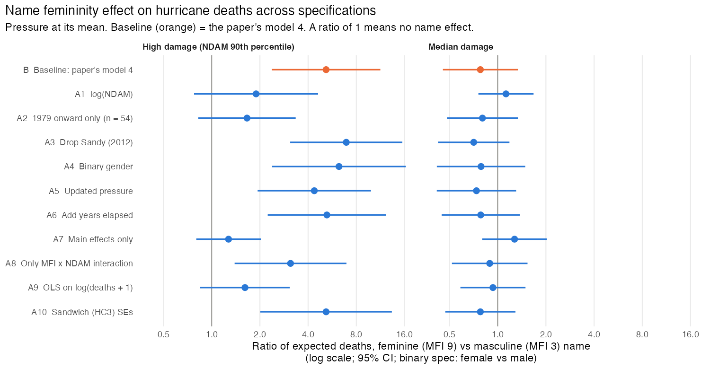

Paper: Jung, Shavitt, Viswanathan & Hilbe (2014), *PNAS* 111(24), 8782–8787, https://doi.org/10.1073/pnas.1402786111.
Full text used: https://pmc.ncbi.nlm.nih.gov/articles/PMC4066510/ (PubMed Central, opened in this session).
The Supporting Information (Table S2, full coefficient table) was not accessible. Its PNAS and PMC links returned bot-check pages, so no Table S2 coefficients appear below unless the main text also reports them.

**Files**

- `analysis.R` is the single script. Run `Rscript analysis.R` from this folder. It reads `hurricanes.csv` and prints every number in this report (`analysis_output.txt` is its output). It also writes `reproduction.csv`, `robustness.csv` and `robustness_forest.png`. It ran from a clean session with R 4.6.1 and glmmTMB 1.1.14.

## 1. Reproduction of the main result

The archival study regresses hurricane deaths (n = 92 US landfalls 1950–2012, excluding Katrina and Audrey) on a negative binomial model. The predictors are the masculinity–femininity index of the name (MFI, `MasFem`), minimum pressure and normalized damage (NDAM), plus MFI × pressure and MFI × NDAM interactions. The paper's claim rests on the MFI × NDAM interaction. Feminine names predict more deaths for high-damage storms and make little difference for low-damage storms. The paper illustrates this with predicted deaths of 15.15 (MFI = 3) vs 41.84 (MFI = 9) for a high-damage storm.

All published numbers from the main text were reproduced. Four small differences are listed under the table. The model fit is identical to the paper's: AIC and BIC match to two decimals, and the likelihood-ratio χ² matches to three.

## 2. Published vs reproduced estimates

Source for every published number: the PMC full text, https://pmc.ncbi.nlm.nih.gov/articles/PMC4066510/ ("Archival Study" in Results, and "Materials and Methods → Archival Study"). No published number was taken from memory.

| Quantity | Published | Reproduced |
|---|---|---|
| n (after excluding Katrina, Audrey) | 92 | 92 |
| Mean / variance of deaths | 20.652 / 1673.152 | 20.652 / 1673.152 |
| Mean minimum pressure | 964.90 | 964.90 |
| r(deaths, NDAM); r(deaths, pressure); r(deaths, category) | 0.555; −0.394; 0.281 | 0.555; −0.394; 0.281 |
| r(NDAM, pressure); r(NDAM, category); r(pressure, category) | −0.566; 0.481; −0.875 | −0.556; 0.481; −0.875 |
| Pearson χ²/df, model 1 (pressure only) | 3.448 | 3.448 |
| Pearson χ²/df, model 2 (+ MFI, NDAM) | 1.548 | 1.548 |
| Pearson χ²/df, models 3 and 4 (+ interactions) | 1.107 | 1.107 |
| Model 3: MFI × pressure, b (SE), p | 0.006 (0.0025), .012 | 0.00632 (0.00249), .011 |
| Model 3: MFI × NDAM, b (SE), p | 0.00002 (0.00001), < .001 | 0.0000169 (0.0000044), < .001 |
| Likelihood-ratio χ² (omnibus) | 60.565, p < .001 | 60.565, p = 9 × 10⁻¹² |
| Model 3 AIC / BIC | 658.09 / 675.74 | 658.09 / 675.74 |
| Model 4 (standardized): MFI × pressure, β (SE), p | 0.395 (0.157), .012 | 0.395 (0.157), .012 |
| Model 4 (standardized): MFI × NDAM, β (SE), p | 0.705 (0.184), < .001 | 0.705 (0.184), < .001 |
| Binary gender: gender × pressure, b, p | −0.038, .037 | **+0.038**, .037 |
| Binary gender: gender × NDAM, b, p | 0.0001, .001 | 0.00011, < .001 (.0006) |
| Split-damage model: b0, b1 (pressure), b2 (low damage) | 42.019364, −0.041257, −0.395306 | 42.019343, −0.041257, −0.395301 |
| Split-damage model: b3 (MFI), b4 (MFI × pressure), b5 (MFI × low damage) | −3.299548, 0.003595, −0.215676 | −3.299530, 0.003595, −0.215676 |
| Predicted deaths, high damage, MFI 1 / MFI 11 | 10.80 / 58.70 | 10.80 / 58.82 |
| Predicted deaths, low damage, MFI 1 / MFI 11 | 5.86 / 3.69 | 5.86 / 3.69 |
| **Predicted deaths, high damage, MFI 3 / MFI 9** | **15.15 / 41.84** | **15.16 / 41.91** |
| Predicted deaths, Charley (MFI 2.889) / Eloise (MFI 8.944) | 14.87 / 41.45 | 14.88 / 41.52 |

Notes on the differences:

- **r(NDAM, pressure).** The paper gives −0.566. The data give −0.556 with `MinPressure_before` and −0.561 with the updated series.
- **Split-damage coefficients.** They agree to 4–5 significant digits, and the predicted counts differ by at most 0.12 deaths. The published coefficients themselves give 58.70 and 15.15/41.84 when plugged into the paper's formula, so the gap is optimizer precision, not a different model.
- **Model 3 MFI × NDAM SE.** The data give 0.0000044, which rounds to 0.00000 at five decimals; the paper prints 0.00001. The p-value and the standardized SE (0.184) match exactly.
- **Binary gender × pressure.** The sign is reversed relative to the paper, but the magnitude and p-value match. The gender × NDAM term has the same sign in both, so a reversed coding of gender would not explain it. The minus sign in the paper is most likely a typo.

## 3. Analysis decisions the paper did not settle

1. **Which pressure variable.** The data contain `MinPressure_before` and `Minpressure_Updated_2014`, and the paper names neither. `MinPressure_before` reproduces the AIC/BIC exactly (the updated series gives AIC 660.74). The README describes `ZMinPressure_A` as the scaled updated pressure. In the data it is the standardized `MinPressure_before` (maximum difference < 0.01; vs the updated series, 1.2).
2. **Which model is "the main result".** Models 3 and 4 are the same fit on different scales; model 4 is standardized. The 15.15 vs 41.84 predictions and Fig. 1 come from a third model with NDAM split into two groups. I treat model 3/4 as the inferential result and the split model as the source of the headline predictions. The robustness baseline is model 4.
3. **Where to split NDAM for the Fig. 1 model.** The paper says only "two categories". A median split reproduces the published coefficients, with NDAM ≤ 1,650 (the median) coded as low (47 low, 45 high). Coding ties at the median as high does not.
4. **Standard errors.** The published SEs are observed-information (Hessian) SEs, as produced by SPSS GENLIN or glmmTMB. `MASS::glm.nb` gives expected-information SEs, which are smaller for the NDAM interaction (0.150 vs 0.184). I used glmmTMB.
5. **Degrees of freedom for Pearson χ²/df.** The paper counts the dispersion parameter as an estimated parameter (df = n − k − 1). The published values reproduce only under that convention.
6. **Null model for the likelihood-ratio χ².** Intercept-only negative binomial with its own dispersion parameter; this gives 60.565.
7. **Standardization.** Sample SD (n − 1), which matches the dataset's `ZMasFem` and `ZNDAM`.
8. **Profile for predicted counts.** Pressure is set at 964.90 as stated. Charley and Eloise are evaluated at the stated MFI values (2.889, 8.944), not at their own damage values.
9. **Before/after 1979.** The paper gives n = 38 and n = 54, which is reproduced only if 1979 storms count as "after" (`Year >= 1979`).
10. **Outliers.** The file already excludes Katrina and Audrey and has no values for them. Re-including them, an obvious robustness check, is therefore not possible with these data.
11. **Numerical scaling (implementation only).** Unstandardized models are fitted with pressure centred and NDAM in $bn; on the raw scales glmmTMB's Hessian is not positive definite. This changes neither the fit, the predictions nor the interaction tests. Coefficients are converted back to the raw scale where reported.

## 4. Robustness

### 4a. Alternatives and predictions (written before any alternative model was run)

**Common estimand.** The specifications use different predictors and scales, so their coefficients cannot be compared directly. Every specification is therefore summarised by the same quantity: the **ratio of expected deaths for a feminine name (MFI = 9) and a masculine name (MFI = 3)**. This is the paper's own contrast (15.15 vs 41.84 deaths). It is evaluated for a high-damage storm (NDAM at its sample 90th percentile, defined on the raw dollar scale) with minimum pressure at its mean. The same ratio at median NDAM is reported as the low-damage check. The paper claims a ratio well above 1 at high damage and a ratio near 1 at low damage. For the binary-gender specification the contrast is female vs male. The 95% CI comes from the delta method on the log scale.

**Baseline.** Model 4 of the paper: negative binomial regression of deaths on standardized MFI, minimum pressure and NDAM, with MFI × pressure and MFI × NDAM interactions. The 92 storms exclude Katrina and Audrey, and pressure is `MinPressure_before`. Each alternative changes one choice relative to this baseline.

| # | Alternative | Justification | Prediction | Expected to change the conclusion? |
|---|---|---|---|---|
| A1 | log(NDAM) instead of raw NDAM | Damage is extremely right-skewed (median 1,650; max 75,000). With raw NDAM on a log link, a few storms set the slope. | High-damage ratio falls towards 1; interaction loses significance. | **Yes** |
| A2 | Storms from 1979 onward only (n = 54) | Before 1979 all storms had female names. Name gender is then confounded with era (warnings, building standards, reporting). | Estimate shrinks; CI includes 1. | **Yes** (at least for significance) |
| A3 | Drop Sandy (2012) | Sandy has the highest NDAM (75,000; next is Andrew, 66,730) and is about 3× most other high-damage storms. It is feminine-named and caused 159 deaths. *[Damage comparison corrected after the analysis; the prediction is as first written.]* | Clear attenuation. Unsure whether the interaction stays significant. | **Possibly** |
| A4 | Binary gender (`Gender_MF`) instead of MFI | The paper's own robustness check. | Similar to baseline. | No |
| A5 | Updated pressure (`Minpressure_Updated_2014`) | The dataset carries a corrected pressure series. (This model's interaction coefficients were already visible while I identified the pressure column: 0.376 and 0.663, both significant.) | Similar to baseline. | No |
| A6 | Add years elapsed as a control | Deaths fall over time (forecasting, evacuation). This also partly absorbs the naming-era confound. | Small attenuation. | No |
| A7 | Main effects only (no interactions) | Tests the plain claim that feminine names are deadlier on average. The interactions were added after main effects (model 2 → model 3). | Ratio close to 1 and not significant, and identical at all damage levels. | **Yes**, for an unconditional "female hurricanes are deadlier" claim |
| A8 | Only the MFI × NDAM interaction (drop MFI × pressure) | The hypothesis concerns severe storms. Two interactions on 92 cases invite overfitting, and the MFI × pressure term has no stated rationale. | Similar to baseline. | No |
| A9 | OLS on log(deaths + 1) | A different model family for skewed counts that is less driven by the largest counts. | Weaker; the interaction may lose significance. | **Possibly** |
| A10 | Robust (sandwich, HC3) SEs on the baseline model | Inference that does not rely on the negative binomial variance function. (HC SEs for the baseline interaction were already visible during orientation; the HC3 SE was 0.179 for MFI × NDAM.) | Same point estimate; wider CI; still significant. | No |

Summary of predictions: A1, A2 and A7 are expected to overturn the headline claim, and A3 and A9 might. The others are expected to leave it intact.

### 4b. Results

Profile values: NDAM 90th percentile = 20,335 (high damage), median = 1,650; pressure at its mean. Ratio > 1 means the feminine name predicts more deaths. The paper's own split-damage model gives a ratio of 2.76 (41.84 / 15.15) for its high-damage group. The baseline ratio here is larger (5.18) because it comes from the continuous-NDAM model evaluated at the 90th percentile.

| # | Specification | n | Ratio, high damage [95% CI] | p | Ratio, median damage [95% CI] | Name × damage interaction z (p) | Prediction |
|---|---|---|---|---|---|---|---|
| B | Baseline (paper's model 4) | 92 | **5.18** [2.37, 11.30] | < .001 | 0.78 [0.45, 1.34] | 3.84 (< .001) | — |
| A1 | log(NDAM) | 92 | **1.89** [0.78, 4.61] | .16 | 1.13 [0.76, 1.67] | 1.28 (.20) | Held: conclusion changes |
| A2 | 1979 onward only | 54 | **1.66** [0.82, 3.34] | .16 | 0.80 [0.48, 1.34] | 1.88 (.06) | Held: conclusion changes |
| A3 | Drop Sandy | 91 | 6.92 [3.09, 15.50] | < .001 | 0.71 [0.42, 1.18] | 4.58 (< .001) | **Wrong**: the effect grew. The baseline model predicts 20,809 deaths for Sandy (observed 159), so Sandy holds the interaction down |
| A4 | Binary gender (female vs male) | 92 | 6.23 [2.38, 16.30] | < .001 | 0.79 [0.42, 1.49] | 3.44 (< .001) | Held |
| A5 | Updated pressure | 92 | 4.37 [1.93, 9.87] | < .001 | 0.74 [0.42, 1.30] | 3.32 (< .001) | Held |
| A6 | Add years elapsed | 92 | 5.24 [2.24, 12.26] | < .001 | 0.78 [0.45, 1.37] | 3.79 (< .001) | Held (no attenuation at all) |
| A7 | Main effects only | 92 | **1.27** [0.80, 2.03] | .31 | 1.27 [0.80, 2.03] | — | Held: no average effect |
| A8 | Only MFI × NDAM interaction | 92 | 3.11 [1.39, 6.94] | .006 | 0.89 [0.52, 1.54] | 2.50 (.013) | Held |
| A9 | OLS on log(deaths + 1) | 92 | **1.61** [0.85, 3.07] | .15 | 0.93 [0.58, 1.49] | 1.45 (.15) | "Possibly" → conclusion changes |
| A10 | Sandwich (HC3) SEs | 92 | 5.18 [2.01, 13.33] | < .001 | 0.78 [0.47, 1.29] | 3.94 (< .001) | Held |

For A9 the ratio is a ratio of geometric means of (deaths + 1), not of expected deaths.

**Summary of the robustness results**

- **Low-damage storms.** In all 11 specifications the median-damage ratio lies between 0.71 and 1.27, and every CI includes 1. The paper's "no effect for less severe storms" holds everywhere.
- **High-damage storms.** 7 of 11 specifications give a ratio well above 1 (3.1 to 6.9) with CIs excluding 1. These are the baseline and the changes that keep raw NDAM in a negative binomial model on the full 1950–2012 sample: a different gender coding, the other pressure series, a time control, one fewer interaction, one fewer storm, or robust SEs.
- **Four specifications remove the effect.** Log damage (A1), the alternating-names era (A2), a model without interactions (A7) and OLS on log deaths (A9) all give ratios of 1.3 to 1.9, with CIs including 1. These are the four alternatives predicted in 4a to change the conclusion (A9 as "possibly"). A3 went against its prediction.
- **Why these four matter.** A1 and A9 change how the skewed damage and death variables enter the model. In the baseline, NDAM enters linearly on a log link, so the name effect grows exponentially with raw dollar damage. A2 removes the period in which all storms had female names, the main alternative explanation for a name–deaths association. A7 shows that feminine-named hurricanes are not deadlier on average once pressure and damage are controlled.

## 5. Does the headline claim hold up?

The published analysis reproduces from these data, but the "female hurricanes are deadlier" effect appears only in negative binomial models that combine a name × damage interaction, damage in raw dollars and the full 1950–2012 sample. It disappears (ratio ≤ 1.9, CI including 1) with log damage, in the post-1979 alternating-names era, without the interaction, or with OLS on log deaths. These data do not support the headline claim as a robust finding.

## References

- Brooks, M. E., Kristensen, K., van Benthem, K. J., Magnusson, A., Berg, C. W., Nielsen, A., Skaug, H. J., Mächler, M., & Bolker, B. M. (2017). glmmTMB balances speed and flexibility among packages for zero-inflated generalized linear mixed modeling. *The R Journal*, 9(2), 378. https://doi.org/10.32614/RJ-2017-066
- Hartig, F. DHARMa: Residual diagnostics for hierarchical (multi-level/mixed) regression models. R package, source of `hurricanes.csv`. https://CRAN.R-project.org/package=DHARMa
- Jung, K., Shavitt, S., Viswanathan, M., & Hilbe, J. M. (2014). Female hurricanes are deadlier than male hurricanes. *Proceedings of the National Academy of Sciences*, 111(24), 8782–8787. https://doi.org/10.1073/pnas.1402786111
- Venables, W. N., & Ripley, B. D. (2002). *Modern applied statistics with S* (4th ed.). Springer. https://doi.org/10.1007/978-0-387-21706-2
- Zeileis, A. (2006). Object-oriented computation of sandwich estimators. *Journal of Statistical Software*, 16(9). https://doi.org/10.18637/jss.v016.i09
