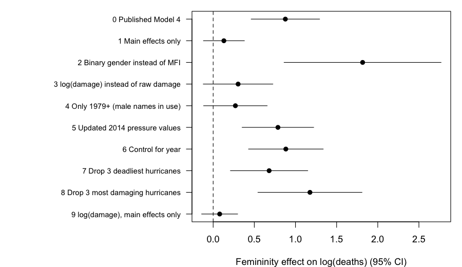

# Reproduction and robustness check: Jung et al. (2014), "Female hurricanes are deadlier than male hurricanes"

All numbers come from `analysis.R` (run: `Rscript analysis.R`; needs the R packages MASS and glmmTMB). The script writes `robustness.csv` and `robustness.png`.

## 1. Main result

The paper's archival result is Model 4: a negative binomial regression of deaths on the standardised masculinity–femininity index (MFI), minimum pressure, normalised damage (NDAM), and the interactions MFI × pressure and MFI × damage. The data exclude Katrina (2005) and Audrey (1957), so n = 92. I fitted this model with `MASS::glm.nb` on the standardised variables in the file (`ZMasFem`, `ZMinPressure_A`, `ZNDAM`).

## 2. Reproduced vs published estimates

Source for all published numbers: https://pmc.ncbi.nlm.nih.gov/articles/PMC4066510/ (full text, opened in this session). I did not use my memory of the paper for any number.

| Quantity | Published | Reproduced |
|---|---|---|
| MFI × pressure, b | 0.395 | 0.395 |
| MFI × pressure, SE | 0.157 | 0.152 |
| MFI × pressure, p | 0.012 | 0.009 |
| MFI × damage, b | 0.705 | 0.705 |
| MFI × damage, SE | 0.184 | 0.150 |
| MFI × damage, p | < 0.001 | < 0.001 |
| Predicted deaths, MFI = 3, high damage | 15.15 | 10.09 (damage +1 SD, pressure at mean) |
| Predicted deaths, MFI = 9, high damage | 41.84 | 51.54 (damage +1 SD, pressure at mean) |

- **Coefficients:** reproduced exactly.
- **Standard errors:** mine are smaller, most clearly for MFI × damage (0.150 vs 0.184). The paper probably used different software or a different variance estimator. The conclusion does not change.
- **Predicted deaths:** not reproduced. The page I opened does not say at which damage and pressure values the paper computed them. My values assume damage at +1 SD and pressure at the mean.
- **Other reproduced coefficients** (the page I opened did not give these): intercept 2.476, MFI 0.172 (SE 0.124, p = 0.16), pressure −0.552, damage 0.863. θ (NB dispersion) = 0.81.

## 3. Analysis decisions the paper did not settle for me

1. **Which pressure variable.** The file has two. `ZMinPressure_A` is standardised from `MinPressure_before`, not from `Minpressure_Updated_2014` as the README says. I checked this in the data. Using `ZMinPressure_A` gives the published coefficients, so I used it for the reproduction.
2. **Software and SE estimator.** I used `glm.nb` (maximum likelihood, model-based SEs). The published SEs are larger, so the paper did something else.
3. **Values for predicted deaths.** "Severe" damage and the pressure level are not defined in the text I read. I used +1 SD and the mean.
4. **Estimand for robustness.** With interactions, the MFI main effect is the effect at average damage. That is not the paper's claim, because the claim is about damaging storms. I used the effect of +1 SD femininity on log deaths at damage +1 SD and mean pressure (MFI + MFI × damage). For models without interactions, it is the MFI main effect.
5. **Fitting engine for the robustness checks.** `glm.nb` did not converge for the log-damage interaction model (its answer depended on the iteration limit: 0.22 or 0.43). I fitted all robustness models with `glmmTMB` (NB2, direct maximum likelihood). All converged. glmmTMB's SEs are slightly wider than glm.nb's because they include uncertainty in θ. Point estimates for converged models are the same.

## 4. Robustness

### Alternatives specified before running

The research question stays fixed: do more feminine-named hurricanes cause more deaths, holding storm severity constant? Expected effect on the conclusion is in brackets.

1. **Main effects only (no interactions).** This tests whether there is a femininity effect overall. [Expected to change: the MFI main effect is non-significant even in Model 4.]
2. **Binary gender instead of MFI.** [Expected to hold: a coarser version of the same variable.]
3. **log(damage) instead of raw damage.** Damage is highly right-skewed. On the raw scale, a few storms with extreme damage drive the MFI × damage slope. [Expected to change.]
4. **Only hurricanes from 1979 on.** Before 1979 all hurricanes had female names, so name gender is confounded with era (warnings, building standards). [Expected to change.]
5. **Updated 2014 pressure values.** [Expected to hold.]
6. **Control for year.** Another way to deal with the era confound. [Uncertain; expected to weaken the result.]
7. **Drop the 3 deadliest hurricanes.** [Expected to weaken the result but keep it.]
8. **Drop the 3 most damaging hurricanes.** [Expected to change, because these points give the interaction its leverage.]
9. **log(damage), main effects only.** Combines 1 and 3. [Expected to change.]

### Results

Effect = change in log(deaths) for +1 SD femininity at damage +1 SD (interaction models) or overall (main-effects models). For specification 2, the effect is female vs male, so its size is on a different scale. Its sign and CI are comparable to the others.

| Specification | n | Estimate | 95% CI | p |
|---|---|---|---|---|
| 0 Published Model 4 | 92 | 0.88 | 0.46 to 1.29 | < .001 |
| 1 Main effects only | 92 | 0.13 | −0.12 to 0.38 | .31 |
| 2 Binary gender instead of MFI | 92 | 1.82 | 0.86 to 2.77 | < .001 |
| 3 log(damage) instead of raw damage | 92 | 0.30 | −0.12 to 0.73 | .16 |
| 4 Only 1979 on | 54 | 0.27 | −0.12 to 0.66 | .17 |
| 5 Updated 2014 pressure values | 92 | 0.79 | 0.35 to 1.22 | < .001 |
| 6 Control for year | 92 | 0.88 | 0.43 to 1.34 | < .001 |
| 7 Drop 3 deadliest | 89 | 0.68 | 0.21 to 1.15 | .005 |
| 8 Drop 3 most damaging | 89 | 1.18 | 0.54 to 1.81 | < .001 |
| 9 log(damage), main effects only | 92 | 0.08 | −0.14 to 0.30 | .48 |

How the results compare with my predictions:
- **As predicted, the effect disappeared** without the interaction (1, 9), with log damage (3), and when only 1979-on storms were used (4).
- **Not as predicted:** the result held when the 3 most damaging storms were dropped (8). Controlling for year (6) did not weaken it.
- **Held as expected:** 2, 5, 7.

## 5. Does the headline claim hold up?

The published coefficients reproduce exactly, but the finding depends on specific choices. The femininity effect is present only when damage enters on its raw, highly skewed scale and interacts with MFI. Without interactions, with log damage, or with only the years in which male and female names were both used, the estimates are near zero and not significant. The data therefore do not give robust support for the claim that feminine-named hurricanes are deadlier.
