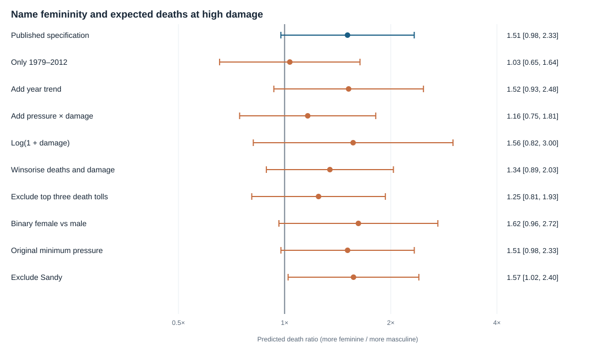

# Female hurricane names and fatalities: reproduction and sensitivity analysis

The published model is reproducible: its name-femininity-by-damage coefficient is 0.705 (p < .001), and at $8,162.5 million damage it predicts 1.51 times as many deaths for MFI 9 as for MFI 3 (95% CI [0.98, 2.33]). Across the nine defensible alternatives, the high-damage ratio exceeds 1 in 9 of 9, but only 1 of 10 high-damage ratio intervals exclude 1 and the name-by-damage interaction has p < .05 in 6 of 9; the headline claim therefore depends on modelling choices and this observational dataset does not establish a causal effect of storm names.

## Data and reference analysis

I analysed the 92 storms in the supplied `hurricanes.csv`, covering 1950–2012. The published archival analysis began with 94 storms and excluded Katrina and Audrey, which are absent from this CSV; I therefore cannot test their inclusion from the supplied data alone. The outcome is total deaths. The reference model is a maximum-likelihood negative binomial regression with a log link, using the supplied standardised name femininity (`ZMasFem`), updated minimum pressure (`ZMinPressure_A`), normalised damage (`ZNDAM`), and the two name-by-severity interactions. Standard errors in the direct reproduction use the model's information matrix, as in the paper. The [published paper](https://cyclingandchill.com/wp-content/uploads/2023/11/22-jung-et-al-2014-female-hurricanes-are-deadlier-than-male-hurricanes.pdf) and the [authors' follow-up analysis](https://publish.illinois.edu/shavitt/files/2014/06/AnalysesonHurricaneData.June17.pdf) were opened for the published values below; none are recalled from memory.

| Quantity | Published | Reproduced | Published-value source |
|:--|--:|--:|:--|
| Storms analysed | 92 | 92 | [Opened source](https://cyclingandchill.com/wp-content/uploads/2023/11/22-jung-et-al-2014-female-hurricanes-are-deadlier-than-male-hurricanes.pdf) |
| Name femininity × normalised damage, log coefficient | 0.705 | 0.705 | [Opened source](https://cyclingandchill.com/wp-content/uploads/2023/11/22-jung-et-al-2014-female-hurricanes-are-deadlier-than-male-hurricanes.pdf) |
| SE of that interaction | 0.184 | 0.184 | [Opened source](https://cyclingandchill.com/wp-content/uploads/2023/11/22-jung-et-al-2014-female-hurricanes-are-deadlier-than-male-hurricanes.pdf) |
| p for that interaction | < .001 | < .001 | [Opened source](https://cyclingandchill.com/wp-content/uploads/2023/11/22-jung-et-al-2014-female-hurricanes-are-deadlier-than-male-hurricanes.pdf) |
| Name femininity × minimum pressure, log coefficient | 0.395 | 0.395 | [Opened source](https://cyclingandchill.com/wp-content/uploads/2023/11/22-jung-et-al-2014-female-hurricanes-are-deadlier-than-male-hurricanes.pdf) |
| SE of pressure interaction | 0.157 | 0.157 | [Opened source](https://cyclingandchill.com/wp-content/uploads/2023/11/22-jung-et-al-2014-female-hurricanes-are-deadlier-than-male-hurricanes.pdf) |
| p for pressure interaction | 0.012 | 0.012 | [Opened source](https://cyclingandchill.com/wp-content/uploads/2023/11/22-jung-et-al-2014-female-hurricanes-are-deadlier-than-male-hurricanes.pdf) |
| AIC, fitted negative binomial model | 658.09 | 658.09 | [Opened source](https://cyclingandchill.com/wp-content/uploads/2023/11/22-jung-et-al-2014-female-hurricanes-are-deadlier-than-male-hurricanes.pdf) |

The near-identical coefficients and fit confirm that the supplied data and model specification reproduce the article's principal archival regression. The paper's illustrative 15.15 versus 41.84 predicted deaths use a separate median-split damage model ([paper](https://cyclingandchill.com/wp-content/uploads/2023/11/22-jung-et-al-2014-female-hurricanes-are-deadlier-than-male-hurricanes.pdf)); they should not be compared with the continuous-damage predictions here. For a consistent comparison across models, I use damage at the full sample's 75th percentile ($8,162.5 million) and pressure at the full sample mean (964.9 mb). At these values, the reference model predicts 9.74 deaths for MFI 3 and 14.69 for MFI 9, a ratio of 1.51 (95% Wald CI [0.98, 2.33]). This ratio and its CI come from the fitted coefficients and covariance matrix, not from independent storms assigned different names.

## Decisions the article did not settle for this reproduction

- I used the supplied standardised columns rather than recomputing them from rounded raw data.
- I chose a common high-damage comparison at the 75th percentile, MFI 3 versus 9, and mean pressure. The article's illustrative predictions instead use a separate, dichotomised-damage model.
- I held the comparison point and full-sample standardisation fixed across subsets, including after 1979, so model contrasts retain the same units.
- I used two-sided Wald tests for interactions and 95% Wald intervals for death ratios. The paper does not give intervals for this continuous-damage contrast.
- I set winsorisation cutoffs to the largest observed values at or below the empirical 90th percentiles (deaths 52, damage $20,020 million) and defined the three highest-death storms as Camille, Diane, Sandy.
- I used information-matrix standard errors in all alternatives for comparability with the published main model. The authors' [follow-up](https://publish.illinois.edu/shavitt/files/2014/06/AnalysesonHurricaneData.June17.pdf) also reports sandwich standard errors, so inferential results can depend on that choice.

## Alternatives specified before fitting

1. **Only 1979–2012 storms.** This is the era of alternating male and female names. Expect weaker evidence because historical naming is confounded with time and the sample shrinks.
2. **Add a linear year term.** Fatality prevention may change over decades. Expect little change if the published association is not driven by a simple time trend.
3. **Add pressure-by-damage interaction.** Storm strength may alter the relation between damage and deaths. Expect the name-by-damage evidence to weaken if the published model omitted this relevant interaction.
4. **Use log(1 + damage), with its name interaction.** Damage is highly skewed, so a nonlinear scale is reasonable. Expect the name-by-damage evidence to weaken if a few costly storms drive it.
5. **Winsorise deaths and damage at their 90th percentiles.** Limit the influence of extreme storms without deleting them. Expect a weaker association if the largest storms dominate.
6. **Exclude the three storms with the most deaths in the supplied data.** This is a simple influence check. Expect weaker evidence because these extreme fatalities are all associated with feminine names.
7. **Use binary female versus male name, with the same interactions.** The headline uses this distinction rather than the continuous rating. Expect a similar direction but less precision because the rating contains more information.
8. **Use the original rather than updated minimum-pressure values.** Both versions are supplied. Expect little change because the measures are close.
9. **Exclude Sandy.** Its unusually costly impact and potentially ambiguous name make it an influential case. Expect a similar or stronger association, as the authors' later analysis suggested.

These choices were recorded in [analysis_plan.md](analysis_plan.md) before fitting the models. Every alternative retains the question of whether more feminine names predict higher deaths among damaging storms; each changes one feature of the reference analysis.

## Sensitivity results

The last column compares MFI 9 with MFI 3 at the common high-damage point, except in the binary-name row, which compares female with male names. The coefficient column is the fitted name-by-damage interaction (SE in parentheses). Its scale differs in the log-damage and binary-name rows, so the ratios are the more comparable summaries. The p value tests the interaction; the interval belongs to the high-damage ratio.

| Model | N | Name × damage coefficient (SE) | Interaction p | High-damage death ratio [95% CI] |
|:--|--:|--:|--:|--:|
| Published specification | 92 | 0.705 (0.184) | < .001 | 1.51 [0.98, 2.33] |
| Only 1979–2012 | 54 | 0.271 (0.151) | 0.073 | 1.03 [0.65, 1.64] |
| Add year trend | 92 | 0.707 (0.187) | < .001 | 1.52 [0.93, 2.48] |
| Add pressure × damage | 92 | 0.229 (0.216) | 0.288 | 1.16 [0.75, 1.81] |
| Log(1 + damage) | 92 | 0.260 (0.206) | 0.208 | 1.56 [0.82, 3.00] |
| Winsorise deaths and damage | 92 | 0.699 (0.280) | 0.012 | 1.34 [0.89, 2.03] |
| Exclude top three death tolls | 89 | 0.602 (0.196) | 0.002 | 1.25 [0.81, 1.93] |
| Binary female vs male | 92 | 1.433 (0.417) | < .001 | 1.62 [0.96, 2.72] |
| Original minimum pressure | 92 | 0.705 (0.184) | < .001 | 1.51 [0.98, 2.33] |
| Exclude Sandy | 91 | 0.849 (0.186) | < .001 | 1.57 [1.02, 2.40] |

The figure's vertical line marks a death ratio of 1. The confidence intervals use the fitted negative binomial covariance matrix, and the displayed alternative specifications are sensitivity checks rather than independent replications. Normalised damage is an outcome of a storm as well as a proxy for its severity and exposure; conditioning on it may introduce bias. The available data also omit exposure, location, warning quality, and other potential causes of deaths, so these regressions cannot identify what would have happened had the same storm received another name. The accompanying experiments address perception and stated intentions, but this report tests the archival fatality result only.

## Conclusion

The published model is reproducible: its name-femininity-by-damage coefficient is 0.705 (p < .001), and at $8,162.5 million damage it predicts 1.51 times as many deaths for MFI 9 as for MFI 3 (95% CI [0.98, 2.33]). Across the nine defensible alternatives, the high-damage ratio exceeds 1 in 9 of 9, but only 1 of 10 high-damage ratio intervals exclude 1 and the name-by-damage interaction has p < .05 in 6 of 9; the headline claim therefore depends on modelling choices and this observational dataset does not establish a causal effect of storm names.

## Reproducibility

Run `python analyse.py` from a clean start after installing `numpy`, `pandas`, `scipy`, and `statsmodels`; the script reads only the supplied CSV and `analysis_plan.md`, then writes this report and `figure.svg`. All fitted numbers, cutoffs, and counts in this report are computed by the script; published values are transcribed in the script from the linked sources. No paid API was used; incremental service cost was $0.
