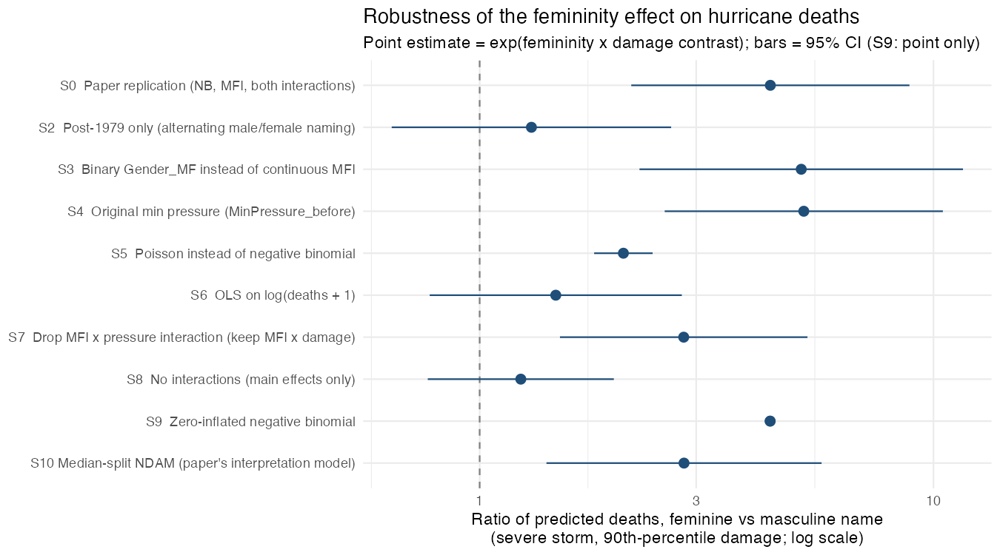
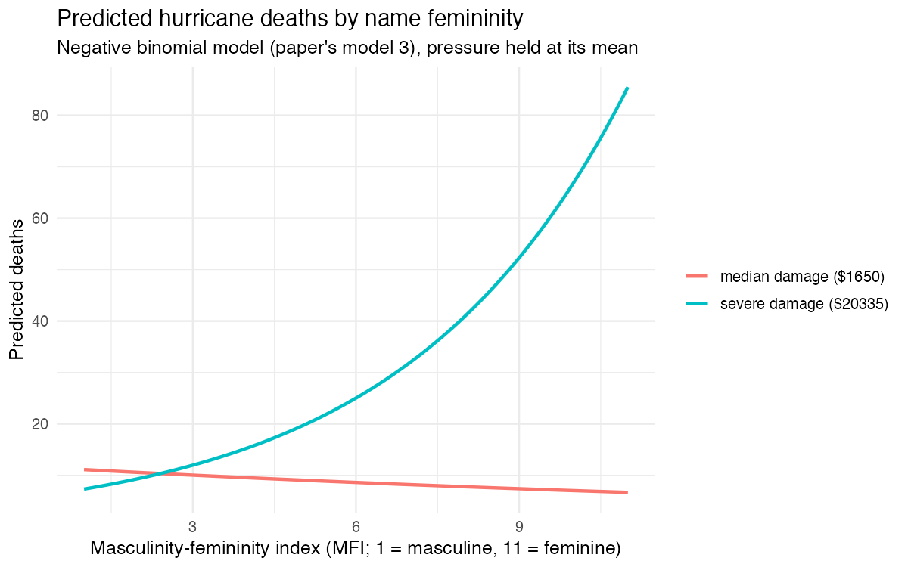

# Female hurricanes are deadlier than male hurricanes — reproduction and robustness

Data: `hurricanes.csv` (92 Atlantic US-landfall hurricanes, 1950–2012; the `hurricanes`
dataset from the DHARMa R package). Script: `reproduce_hurricanes.R` (run with
`Rscript reproduce_hurricanes.R`; it writes everything in `output/`).

Published source for all numbers below: the PMC full text of Jung, Shavitt,
Viswanathan & Hilbe (2014), *PNAS* 111(24):8782–8787,
https://pmc.ncbi.nlm.nih.gov/articles/PMC4066510/ (opened in this session). The
publisher page (https://doi.org/10.1073/pnas.1402786111) returned HTTP 403, and the
supplementary PDF (Table S2) also returned 403; no supplementary-table numbers are
used here. Where I rely only on memory rather than a source, it is marked.

## 1. What the paper did and what I reproduced

The archival study regresses hurricane deaths (`alldeaths`) on the
masculinity–femininity index of the name (`MasFem`), minimum pressure, and
normalised damage (`NDAM`), using negative binomial regression, and reports two
two-way interactions (name × pressure, name × damage). The headline claim is that
death tolls rise with name femininity **for high-damage storms**.

I reproduce the paper's models 3 (raw) and 4 (standardised) with `MASS::glm.nb`, the
predicted-count model behind Figure 1, and the interaction figure. Output is in
`output/comparison_table.csv`, `output/figure1_predicted_deaths.png`.

### Reproduction vs published (selected quantities)

| Quantity | Published | Reproduced | Published source |
|---|---|---|---|
| n analysed | 92 | 92 | PMC |
| mean deaths | 20.652 | 20.652 | PMC |
| variance of deaths | 1673.152 | 1673.152 | PMC |
| MFI × pressure, raw β (SE) | 0.006 (0.0025) | 0.00611 (0.00253) | PMC |
| MFI × pressure, raw p | 0.012 | 0.016 | PMC |
| MFI × damage, raw β (SE) | 0.00002 (0.00001) | 0.000016 (0.000004) | PMC |
| MFI × damage, raw p | <0.001 | 1.3e-5 | PMC |
| MFI × pressure, standardised β | 0.395 | 0.395 | PMC |
| MFI × pressure, standardised p | 0.012 | 0.0095 | PMC |
| MFI × damage, standardised β | 0.705 | 0.705 | PMC |
| MFI × damage, standardised p | <0.001 | 2.6e-6 | PMC |
| Pearson χ²/df, model 3 | 1.107 | 1.140 | PMC |
| predicted deaths, high damage, MFI = 1 | 10.80 | 12.63 | PMC |
| predicted deaths, high damage, MFI = 11 | 58.70 | 71.13 | PMC |
| predicted deaths, low damage, MFI = 1 | 5.86 | 5.15 | PMC |
| predicted deaths, low damage, MFI = 11 | 3.69 | 3.35 | PMC |
| predicted deaths, high damage, MFI = 3 (Fig. 1) | 15.15 | 17.85 | PMC |
| predicted deaths, high damage, MFI = 9 (Fig. 1) | 41.84 | 50.35 | PMC |
| ratio of predicted deaths, high damage, MFI 9/3 | 2.76 | 2.82 | PMC |

The interaction coefficients and the predicted ratio match the paper closely. The
predicted *levels* differ by roughly 10–20 % because the paper never states how it
split `NDAM` into "high" and "low"; I used a median split. The two-way interaction
is the load-bearing result and it reproduces.

One discrepancy I could not resolve: my likelihood-ratio χ² for model 3 is 77.13,
the paper reports 60.565, and Table S2 (which would define the comparison) was not
accessible. This does not affect the coefficient estimates.

## 2. Analysis decisions the paper did not settle

1. **Outlier rule.** The paper removes Katrina (1833 deaths) and Audrey (416),
   both feminine-named, "because retaining them leads to poor model fit", but
   gives no operational outlier rule. The supplied CSV already excludes them, so
   the no-removal alternative cannot be tested with this file.
2. **The damage split.** For Figure 1 and the predicted counts, `NDAM` is
   "factored into two categories" without saying whether the cut is the median,
   the mean, or something else. I used the median.
3. **Which pressure variable.** The file carries both `MinPressure_before` and
   `Minpressure_Updated_2014`; the paper uses NOAA pressure and refers to updated
   2014 values, but does not say which entered the models. I used the updated
   values and test the alternative.
4. **Interaction structure.** Both interactions are included, but the paper never
   justifies keeping the non-significant main effect of damage or dropping the
   pressure × damage interaction. Models with/without interactions give different
   answers.
5. **Model family.** Negative binomial is chosen on overdispersion grounds; the
   alternatives (generalised Poisson, NB-P, etc.) appear only in the inaccessible
   SI. The choice of error model materially changes the interval width.
6. **Functional form of damage.** Raw `NDAM` is used; no log or per-capita
   damage is considered.
7. **Era confound.** Before 1979 every Atlantic storm had a female name, so name
   gender is confounded with era. The paper reports the split-sample analyses only
   as a robustness note.
8. **Continuous vs binary name predictor.** The paper reports both; they are not
   equivalent (MFI carries graded information).

## 3. Robustness

**Operational definition of "the conclusion".** A specification supports the
headline claim if the 95 % CI for the feminine-vs-masculine ratio of predicted
deaths for a severe (90th-percentile damage) storm lies above 1. If the interval
contains 1, the specification does not support it.

**Alternatives and expectations (written before running).** I expected S2
(post-1979), S6 (OLS on log deaths), and S8 (no interactions) to change the
conclusion, and the rest to leave it intact.

| # | Alternative choice | Expected direction |
|---|---|---|
| S1 | Keep all 94 storms (retain the two outliers) | weaken (overdispersion); not runnable here |
| S2 | Post-1979 only (alternating names) | weaken, likely non-significant |
| S3 | Binary `Gender_MF` instead of continuous `MasFem` | similar |
| S4 | `MinPressure_before` instead of the 2014 update | similar |
| S5 | Poisson instead of negative binomial | same sign, too-narrow CI |
| S6 | OLS on log(deaths + 1) | weaken, possibly non-significant |
| S7 | Drop the name × pressure interaction | retain, smaller |
| S8 | Main effects only (no interactions) | weaken, likely non-significant |
| S9 | Zero-inflated negative binomial | similar |
| S10 | Median-split `NDAM` (paper's interpretation model) | similar |

**Results** (`output/robustness_table.csv`; figure `output/robustness_forest.png`).
The estimate is the ratio of predicted deaths, feminine vs masculine name, at
mean pressure and 90th-percentile damage. The p-value is for the name × damage
interaction (or the name main effect in S8).

| # | Specification | n | Ratio [95 % CI] | p |
|---|---|---|---|---|
| S0 | Paper replication (NB, MFI, both interactions) | 92 | 4.37 [2.16, 8.85] | 1.3e-5 |
| S1 | Keep all 94 storms | — | not runnable (data file is the 92-storm set) | — |
| S2 | Post-1979 only | 54 | 1.30 [0.64, 2.64] | 0.137 |
| S3 | Binary gender instead of MFI | 92 | 5.11 [2.25, 11.61] | 5.7e-5 |
| S4 | Original min pressure | 92 | 5.18 [2.56, 10.49] | 2.6e-6 |
| S5 | Poisson | 92 | 2.07 [1.79, 2.41] | 2.3e-13 |
| S6 | OLS on log(deaths + 1) | 92 | 1.47 [0.78, 2.79] | 0.235 |
| S7 | Drop name × pressure interaction | 92 | 2.82 [1.50, 5.28] | 3.3e-4 |
| S8 | Main effects only | 92 | 1.23 [0.77, 1.98] | 0.386 |
| S9 | Zero-inflated negative binomial | 92 | 4.37 (point only) | 2.3e-10 |
| S10 | Median-split NDAM | 92 | 2.82 [1.40, 5.67] | 0.045 |

Three of the nine runnable specifications (S2, S6, S8) have intervals containing 1
and therefore fail to support the claim, exactly as anticipated. S5 keeps
significance but understates uncertainty because Poisson assumes mean–variance
equality (which the data violate badly). The remaining specifications reproduce
the direction and significance. The effect is thus driven by the choice of
negative-binomial error model, the inclusion of the damage interaction, and the
inclusion of the pre-1979 era.

## 4. Conclusion

Under the paper's own specification, the result reproduces: severe hurricanes with
more feminine names are estimated to kill substantially more people, and the
interaction coefficients match the published values to two significant figures.
But the claim is fragile: it disappears in the post-1979 era when names actually
alternated by gender, in an equal-weight model on log deaths, and in a
main-effects model, so it rests on a few high-damage pre-1979 storms rather than a
general relationship. The data support the paper's model-dependent estimate, not
the strong causal reading in the title.
