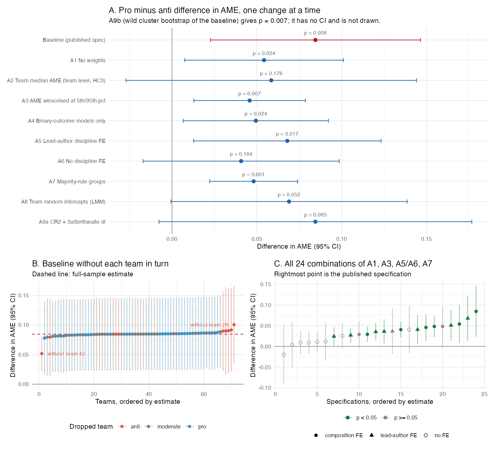

# Reproduction and robustness check: Borjas & Breznau (2026), "Ideological bias in the production of research findings"

Paper: *Science Advances* 12(1), https://doi.org/10.1126/sciadv.adz7173

**How to rerun.** From this folder: `Rscript analysis.R`. The script reads only `data/df.dta`. It writes the tables below (`output/*.md`, `output/*.csv`), the figure (`output/robustness.png`) and a console log (`output_log.txt` when run as `Rscript analysis.R > output_log.txt 2>&1`). Run time is about 10 seconds. The seed is fixed. Packages: haven, dplyr, sandwich, clubSandwich, lme4, ggplot2, patchwork.

## 1. Main result and reproduction

**Headline claim (abstract).** "Teams composed of pro-immigration researchers estimated more positive impacts of immigration on public support for social programs, while anti-immigration teams estimated more negative impacts."

**Main number.** Table 1, column 3: in a regression of each model's average marginal effect (AME) on team type, pro-immigration teams report AMEs 0.085 (SE 0.031, p = 0.008) higher than anti-immigration teams. The regression is at model level (1,253 models, 71 teams), weighted by 1/(models per team), with controls for statistical skill, topic experience, team size and a 13-category discipline-composition code (`mdegree`), and SEs clustered by team.

**Result.** All nine columns of Table 1 reproduce exactly. The largest absolute difference from the Stata log is 5 × 10⁻⁸ for coefficients and for SEs. The script also rebuilds the team groups (`group1`, `group3`, `p12`, `p56`) and the tail outcomes (`neg10s`, `pos10s`) from their components and confirms that they equal the stored variables.

## 2. Published and reproduced estimates

Sources of the published numbers:

- **"Published est (SE)"** and **R² pub**: Table 1 of the article, read from the Europe PMC full text opened in this session: https://www.ebi.ac.uk/europepmc/webservices/rest/PMC12757037/fullTextXML
- **"Stata log est (SE)"**: `code/Log Files/02_Main_Regs.log` in this folder.
- **Published p = 0.008 for the column 3 difference**: article text, same Europe PMC URL ("statistically significant (with a P value of 0.008)"). Reproduced p = 0.008.
- No number is taken from memory.

Terms: `proindex` = team mean immigration sentiment (1–6); `p12`/`p56` = share of team answering 1–2 (anti) / 5–6 (pro); `group1` = anti-immigration team; `group3` = pro-immigration team (reference = moderate). Outcomes: `ame`; `neg10s` = AME below the 10th percentile and significant; `pos10s` = AME above the 90th percentile and significant (linear probability models).

<!-- generated by analysis.R -->
| Col | Outcome | Term | Published est (SE) | Stata log est (SE) | Reproduced est (SE) | Reproduced p | R² pub / repro |
| --- | --- | --- | --- | --- | --- | --- | --- |
| 1 | ame | proindex | 0.011 (0.006) | 0.0109 (0.0057) | 0.0109 (0.0057) | 0.061 | 0.062 / 0.062 |
| 2 | ame | p12 | -0.050 (0.025) | -0.0504 (0.0253) | -0.0504 (0.0253) | 0.050 | 0.065 / 0.065 |
| 2 | ame | p56 | 0.023 (0.019) | 0.0235 (0.0193) | 0.0235 (0.0193) | 0.229 | 0.065 / 0.065 |
| 2 | ame | p56 - p12 | 0.074 (0.024) | 0.0739 (0.0243) | 0.0739 (0.0243) | 0.003 | 0.065 / 0.065 |
| 3 | ame | group1 | -0.057 (0.031) | -0.0572 (0.0306) | -0.0572 (0.0306) | 0.066 | 0.071 / 0.071 |
| 3 | ame | group3 | 0.027 (0.015) | 0.0273 (0.0147) | 0.0273 (0.0147) | 0.069 | 0.071 / 0.071 |
| 3 | ame | group3 - group1 | 0.085 (0.031) | 0.0845 (0.0310) | 0.0845 (0.0310) | 0.008 | 0.071 / 0.071 |
| 4 | neg10s | proindex | -0.051 (0.021) | -0.0514 (0.0207) | -0.0514 (0.0207) | 0.015 | 0.096 / 0.096 |
| 5 | neg10s | p12 | 0.081 (0.103) | 0.0809 (0.1028) | 0.0809 (0.1028) | 0.434 | 0.115 / 0.115 |
| 5 | neg10s | p56 | -0.161 (0.064) | -0.1607 (0.0643) | -0.1607 (0.0643) | 0.015 | 0.115 / 0.115 |
| 5 | neg10s | p56 - p12 | -0.242 (0.107) | -0.2416 (0.1074) | -0.2416 (0.1074) | 0.028 | 0.115 / 0.115 |
| 6 | neg10s | group1 | 0.150 (0.123) | 0.1500 (0.1232) | 0.1500 (0.1232) | 0.227 | 0.133 / 0.133 |
| 6 | neg10s | group3 | -0.124 (0.044) | -0.1239 (0.0440) | -0.1239 (0.0440) | 0.006 | 0.133 / 0.133 |
| 6 | neg10s | group3 - group1 | -0.274 (0.125) | -0.2739 (0.1252) | -0.2739 (0.1252) | 0.032 | 0.133 / 0.133 |
| 7 | pos10s | proindex | 0.019 (0.012) | 0.0192 (0.0115) | 0.0192 (0.0115) | 0.099 | 0.087 / 0.087 |
| 8 | pos10s | p12 | -0.130 (0.057) | -0.1304 (0.0569) | -0.1304 (0.0569) | 0.025 | 0.090 / 0.091 |
| 8 | pos10s | p56 | -0.016 (0.041) | -0.0161 (0.0413) | -0.0161 (0.0413) | 0.697 | 0.090 / 0.091 |
| 8 | pos10s | p56 - p12 | 0.114 (0.045) | 0.1142 (0.0458) | 0.1142 (0.0458) | 0.015 | 0.090 / 0.091 |
| 9 | pos10s | group1 | -0.070 (0.037) | -0.0695 (0.0378) | -0.0695 (0.0378) | 0.070 | 0.089 / 0.089 |
| 9 | pos10s | group3 | 0.017 (0.034) | 0.0173 (0.0340) | 0.0173 (0.0340) | 0.612 | 0.089 / 0.089 |
| 9 | pos10s | group3 - group1 | 0.087 (0.035) | 0.0868 (0.0347) | 0.0868 (0.0347) | 0.015 | 0.089 / 0.089 |

Two differences from the published table, both in the paper's presentation and not in the estimates:

- **R², column 8.** The log gives 0.0909; the paper prints 0.090 (rounding).
- **Significance stars.** The table note defines * as P < 0.1 and ** as P < 0.05. Five published estimates have P < 0.05 but carry one star: column 5 difference (p = 0.028), column 6 difference (p = 0.032), column 8 `p12` (p = 0.025), column 8 difference (p = 0.015), column 9 difference (p = 0.015). The stars understate the significance.

## 3. Analysis decisions the paper did not settle

The reproduction starts from `df.dta`, so decisions already made in `01_Data_Prep.do` are inherited. Items 1–6 are decisions I had to make; items 7–10 are inherited choices that the paper does not state and that I checked or kept.

1. **Which result is "the main result".** I took the pro-minus-anti difference in Table 1, column 3 (0.085), because the abstract states the claim in terms of pro- and anti-immigration teams and the text reports its p-value. Columns 1–2 (continuous measures) and 4–9 (tail outcomes) are reproduced but not used as the robustness target.
2. **Sample.** `df.dta` has 1,254 rows. One row has no team, no AME and no covariates; it comes from the merge with `sem_p.csv`. I dropped it, giving 1,253 models and 71 teams.
3. **Type of clustered SE.** The paper says only "clustered at the team level". I used CR1 with Stata's correction G/(G−1)·(N−1)/(N−K) and p-values from a t distribution with G − 1 = 70 df. This matches the log to 7 decimals.
4. **Weight type in the tail regressions.** The Stata code uses analytic weights for the AME columns and importance weights (`iw`) for the tail columns. Both give the same coefficients. With `sandwich::vcovCL` and ordinary weights I reproduce the `iw` SEs exactly, so the weight type does not matter here.
5. **Missing test statistic.** One model of team 75 has AME −0.073 and a missing z. Stata treats a missing value as larger than any number, so this model counts as "significant" in `neg10s`. I kept this to match the published sample. The paper does not mention it.
6. **Significance threshold for the tail outcomes.** The Table 1 note says "P < 0.05"; the text says "significant at the 5% level in a one-tailed test (|t| > 1.645)"; the code uses z > 1.645. I followed the code. A two-sided 5% test would be |t| > 1.96.
7. **Tail cut-offs.** The 10th/90th percentile cut-offs (−0.071, 0.052) are unweighted percentiles over all 1,253 models, typed into the code as constants.
8. **Teams in both extreme groups.** Teams 61 and 64 have one anti member and a pro majority. The code classifies them as pro; the paper's definitions would put them in both groups and it does not mention the overlap.
9. **Imputations and fixes in `df.dta`.** Team 27's gender, topic experience, statistical skill and prior belief are hot-deck imputed; team 8's statistical skill is set by hand; team sizes of teams 93 and 94 are corrected. I did not change these.
10. **Discipline fixed effects with single-team cells.** Four of the 13 `mdegree` cells hold one team each: team 33 (pro), teams 46 and 47 (anti) and team 59 (moderate). Their fixed effect absorbs them completely, so the anti-immigration coefficient is identified from 7 of the 9 anti teams. The paper does not discuss this.

## 4. Robustness

### 4a. Robustness plan (written before any model was run)

**Fixed research question.** Do teams whose members are pro-immigration report different estimates of the effect of immigration on welfare support (AME) than teams with at least one anti-immigration member, given the teams' skills, size and disciplinary background?

**Target quantity.** Difference between pro-immigration and anti-immigration teams in the AME (Table 1, column 3; published value 0.085, SE 0.031). The published regression is weighted by 1/(models per team), has discipline-composition fixed effects (`mdegree`), and uses team-clustered SEs.

Facts about the data that shape the plan (from inspecting `data/df.dta`):

- The anti-immigration group has 9 teams. Two of them (teams 46 and 47) sit alone in their `mdegree` cell, so their fixed effect absorbs them. The anti coefficient is identified from 7 teams.
- Team 42 (anti) submitted 2 models with mean AME −0.258. With 1/nmodel weights it has the same weight as a 48-model team.
- 195 models use a scale outcome (`scale == 1`); their AMEs are not in probability units but are pooled with the binary-outcome AMEs.

| # | Alternative choice | Why a reasonable analyst could pick it | Expected to change the conclusion? |
|---|---|---|---|
| A1 | No weights (each model counts once) | Teams that ran more models give more information; the model is the unit of observation | **Yes, probably.** Team 42 loses almost all weight; the anti estimate should move toward 0. |
| A2 | Team-level median AME as outcome (n = 71, HC3 SEs) | Each team gets one summary number that is not driven by a few extreme models | Unclear. Team 42's median equals its mean, so its influence stays. |
| A3 | AME winsorised at the 5th/95th percentiles | Some AMEs exceed ±1 (implausible for a probability change); outliers dominate a mean | Probably not. Point estimate should shrink but SEs shrink too. |
| A4 | Binary-outcome models only (`scale == 0`) | Keeps all AMEs in the same unit | No. |
| A5 | Lead author's discipline fixed effects (`degree1`) instead of the 13-category composition code | Simpler control with fewer single-team cells | Possibly. More anti teams contribute to identification. |
| A6 | No discipline fixed effects | Discipline may be partly an outcome of the same values that drive ideology; the paper says this control produces the large effect | **Yes, probably.** Effect should weaken. |
| A7 | Majority-rule groups: anti if > 50% of members answer 1–2, pro if > 50% answer 5–6 | Symmetric rule for both groups; the published rule calls a team anti if any one member is anti | **Yes, probably.** Anti group shrinks from 9 to 5 teams; teams 42 and 75 become moderate. |
| A8 | Linear mixed model with team random intercepts (no weights) | Standard approach for models nested in teams | Possibly. Weights fall between equal-team and equal-model. |
| A9 | Inference only: CR2 SEs with Satterthwaite df, and wild cluster bootstrap (Webb weights, null imposed) | Only 71 clusters and 7 identifying anti clusters; CR1 SEs can be too small | Possibly at the 5% level. Point estimate does not change. |

**Diagnostic (not one of the alternatives):** drop each team in turn and re-estimate the baseline.

### 4b. Robustness results

Target: pro-minus-anti difference in AME. Each row changes one choice from the baseline. CIs use the t distribution with 70 df unless the note says otherwise (A2: residual df; A8: normal; A9a: Satterthwaite df). "Anti / pro teams" counts teams in the estimation sample.

<!-- generated by analysis.R -->
| Specification | Estimate | SE | 95% CI | p | Models | Anti / pro teams | Note |
| --- | --- | --- | --- | --- | --- | --- | --- |
| Baseline (published spec) | 0.085 | 0.031 | [0.023, 0.146] | 0.008 | 1253 | 9 / 31 |  |
| A1 No weights | 0.054 | 0.023 | [0.007, 0.101] | 0.024 | 1253 | 9 / 31 |  |
| A2 Team median AME (team level, HC3) | 0.059 | 0.043 | [-0.027, 0.144] | 0.176 |   67 | 7 / 30 | teams in single-team discipline cells dropped |
| A3 AME winsorised at 5th/95th pct | 0.046 | 0.016 | [0.013, 0.079] | 0.007 | 1253 | 9 / 31 | bounds -0.138, 0.121 |
| A4 Binary-outcome models only | 0.049 | 0.021 | [0.007, 0.092] | 0.024 | 1058 | 7 / 19 |  |
| A5 Lead-author discipline FE | 0.068 | 0.028 | [0.013, 0.123] | 0.017 | 1233 | 9 / 30 | team 33 has no discipline data and drops out |
| A6 No discipline FE | 0.041 | 0.029 | [-0.017, 0.099] | 0.164 | 1253 | 9 / 31 |  |
| A7 Majority-rule groups | 0.048 | 0.013 | [0.022, 0.074] | < 0.001 | 1253 | 5 / 31 |  |
| A8 Team random intercepts (LMM) | 0.069 | 0.036 | [-0.001, 0.139] | 0.052 | 1253 | 9 / 31 |  |
| A9a CR2 + Satterthwaite df | 0.085 | 0.036 | [-0.008, 0.177] | 0.065 | 1253 | 9 / 31 | Satterthwaite df = 5.0 |
| A9b Wild cluster bootstrap (Webb, 9,999 draws) | 0.085 | 0.031 | – | 0.007 | 1253 | 9 / 31 | p from bootstrap; SE is CR1 |

*Figure. A: each alternative choice on its own. B: the baseline re-estimated 71 times, each time without one team. C: all 24 combinations of weights (1/nmodel or none), outcome (raw or winsorised AME), discipline control (composition FE, lead-author FE, none) and group rule (published or majority).*

**Comparison with the expectations in section 4a.**

| # | Expected to change the conclusion? | What happened |
|---|---|---|
| A1 No weights | Yes, probably | Estimate falls from 0.085 to 0.054; still p = 0.024. Conclusion holds. |
| A2 Team median | Unclear | 0.059, p = 0.176. Not significant. Run on 67 teams, not the planned 71: the 4 teams alone in their discipline cell have leverage 1, which makes HC3 undefined, and they do not affect the estimate. |
| A3 Winsorised | Probably not | 0.046, p = 0.007. Holds; estimate about halves. |
| A4 Binary outcomes | No | 0.049, p = 0.024. Holds. |
| A5 Lead-author FE | Possibly | 0.068, p = 0.017. Holds. |
| A6 No discipline FE | Yes, probably | 0.041, p = 0.164. Not significant. |
| A7 Majority rule | Yes, probably | 0.048, p < 0.001. Holds; expectation was wrong. |
| A8 Random intercepts | Possibly | 0.069, p = 0.052. Borderline. |
| A9 Inference | Possibly | CR2: p = 0.065 (Satterthwaite df = 5.0). Wild bootstrap: p = 0.007. The two small-sample methods disagree. |

**Leave one team out.** The estimate ranges from 0.052 (without team 42) to 0.101 (without team 28). All 71 estimates have p < 0.05. Team 42 (anti, 2 models, mean AME −0.258) is the most influential team, but the result does not depend on it.

<!-- generated by analysis.R -->
| Dropped team | Group | Estimate | SE | p |
| --- | --- | --- | --- | --- |
| 42 | anti | 0.052 | 0.015 | 0.001 |
| 62 | pro | 0.078 | 0.032 | 0.016 |
| 93 | moderate | 0.079 | 0.033 | 0.020 |
| 36 | anti | 0.090 | 0.036 | 0.016 |
| 94 | anti | 0.092 | 0.036 | 0.013 |
| 28 | anti | 0.101 | 0.033 | 0.003 |

**All 24 combinations** (panel C). Every estimate with a discipline control is positive (0.024 to 0.085), and 13 of these 16 have p < 0.05. None of the 8 estimates without a discipline control has p < 0.05 (range −0.020 to 0.041). The published specification gives the largest estimate of all 24.

Full table of the 24 combinations

<!-- generated by analysis.R -->
| Weights | Outcome | Discipline | Groups | Estimate | SE | p |
| --- | --- | --- | --- | --- | --- | --- |
| 1/nmodel | AME | composition | published | 0.085 | 0.031 | 0.008 |
| none | AME | composition | published | 0.054 | 0.023 | 0.024 |
| 1/nmodel | winsorised | composition | published | 0.046 | 0.016 | 0.007 |
| none | winsorised | composition | published | 0.029 | 0.016 | 0.076 |
| 1/nmodel | AME | lead author | published | 0.068 | 0.028 | 0.017 |
| none | AME | lead author | published | 0.051 | 0.019 | 0.009 |
| 1/nmodel | winsorised | lead author | published | 0.036 | 0.015 | 0.019 |
| none | winsorised | lead author | published | 0.024 | 0.011 | 0.038 |
| 1/nmodel | AME | none | published | 0.041 | 0.029 | 0.164 |
| none | AME | none | published | 0.012 | 0.023 | 0.613 |
| 1/nmodel | winsorised | none | published | 0.025 | 0.016 | 0.108 |
| none | winsorised | none | published | 0.011 | 0.011 | 0.340 |
| 1/nmodel | AME | composition | majority | 0.048 | 0.013 | < 0.001 |
| none | AME | composition | majority | 0.048 | 0.025 | 0.058 |
| 1/nmodel | winsorised | composition | majority | 0.029 | 0.009 | 0.003 |
| none | winsorised | composition | majority | 0.040 | 0.009 | < 0.001 |
| 1/nmodel | AME | lead author | majority | 0.041 | 0.018 | 0.026 |
| none | AME | lead author | majority | 0.037 | 0.028 | 0.201 |
| 1/nmodel | winsorised | lead author | majority | 0.027 | 0.009 | 0.004 |
| none | winsorised | lead author | majority | 0.035 | 0.011 | 0.002 |
| 1/nmodel | AME | none | majority | 0.004 | 0.028 | 0.875 |
| none | AME | none | majority | -0.020 | 0.037 | 0.592 |
| 1/nmodel | winsorised | none | majority | 0.009 | 0.015 | 0.533 |
| none | winsorised | none | majority | 0.009 | 0.014 | 0.504 |

**Summary of the robustness checks.**

- **Direction.** All 8 alternatives that change the estimate (A1–A8) and all 16 grid specifications with a discipline control give a positive difference.
- **Size.** Under the alternatives the difference is 0.041–0.069, against 0.085 published. The published combination of choices gives the largest estimate.
- **Significance.** The result stays significant at 5% under 5 of the 8 alternatives that change the estimate (A1, A3, A4, A5, A7). It is not significant at 5% with team-median outcomes (A2, p = 0.176), without discipline fixed effects (A6, p = 0.164) or with team random intercepts (A8, p = 0.052). For the baseline estimate, CR2 SEs give p = 0.065 and the wild cluster bootstrap gives p = 0.007.
- **Dependence on the discipline control.** Without any discipline control the difference is 0.041 or smaller and never significant. The paper names this control as the one that produces the effect.

## 5. Does the headline claim hold up?

Under every alternative with a discipline control, pro-immigration teams report more positive AMEs than anti-immigration teams, so the claim holds in direction. The published 0.085 is the largest estimate in the set; most alternatives give about half to four-fifths of it. Significance at 5% depends on the discipline fixed effects, the outcome summary and the small-sample correction, so the evidence for the size and precision of the effect is weaker than Table 1 suggests.
