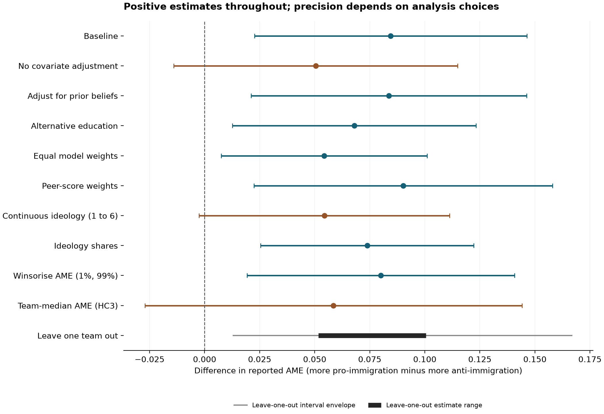

# Reproduction of Borjas and Breznau: ideology and research findings

The main adjusted association reproduces: pro-immigration teams report AMEs 0.0845 higher than anti-immigration teams (SE = 0.0310, 95% CI [0.0226, 0.1464], p = 0.008). Every planned analysis retains a positive point estimate, but the evidence against a zero association depends on the specification. These are associations between teams' attitudes and their reported results; they do not by themselves identify a causal effect of ideology or establish which estimates are biased.

The research question is whether teams with more pro-immigration attitudes report more positive estimates of immigration's effect on support for social welfare programmes. I reproduce all nine specifications in Table 1, then examine the AME association under the ten choices recorded in [robustness_plan.md](robustness_plan.md) before loading the data or fitting models. The checks concern this association; they do not reproduce the paper's separate decomposition of research-design mechanisms.

## Published estimates and reproduction

The primary outcome, `ame`, is the team's reported average marginal effect, in the units supplied in the package. A positive value means more immigration predicts more support for social programmes. The sample contains 1,253 models from 71 teams: 9 anti-immigration, 31 moderate, and 31 pro-immigration. I excluded 1 empty merge-only row from `data/df.dta`; no observed AMEs were removed from the baseline.

I followed `code/Stata Main Results/02_Main_Regs.do`: weighted least squares with weight `1/nmodel`, team-clustered standard errors, and controls for statistical skills, topic experience, team size, and categorical disciplinary composition (`mdegree`). All covariates are constant within teams, so the point estimates equal a regression of team means with equal team weights; the script verifies that equivalence. Team categories follow the supplied coding, including its priority for a pro-immigration majority when a team also includes an anti-immigration respondent. Moderate teams are the reference group; the main contrast subtracts the anti-team coefficient from the pro-team coefficient.

| Table 1 column; outcome | Ideology contrast | Published b (SE) | Reproduced b (SE) | Reproduced 95% CI; p | Source for published b and SE |
| --- | --- | --- | --- | --- | --- |
| 1; AME | Mean sentiment: one point | 0.011 (0.006) | 0.0109 (0.0057) | [-0.0005, 0.0222]; 0.061 | [Article, Table 1, col. 1](https://www.ebi.ac.uk/europepmc/webservices/rest/PMC12757037/fullTextXML); [local log, line 354](code/Log%20Files/02_Main_Regs.log) |
| 2; AME | All-pro minus all-anti shares | 0.074 (0.024) | 0.0739 (0.0243) | [0.0255, 0.1222]; 0.003 | [Article, Table 1, col. 2](https://www.ebi.ac.uk/europepmc/webservices/rest/PMC12757037/fullTextXML); [local log, line 424](code/Log%20Files/02_Main_Regs.log) |
| 3; AME | Pro minus anti team | 0.085 (0.031) | 0.0845 (0.0310) | [0.0226, 0.1464]; 0.008 | [Article, Table 1, col. 3](https://www.ebi.ac.uk/europepmc/webservices/rest/PMC12757037/fullTextXML); [local log, line 547](code/Log%20Files/02_Main_Regs.log) |
| 4; Extreme negative | Mean sentiment: one point | -0.051 (0.021) | -0.0514 (0.0207) | [-0.0926, -0.0102]; 0.015 | [Article, Table 1, col. 4](https://www.ebi.ac.uk/europepmc/webservices/rest/PMC12757037/fullTextXML); [local log, line 1379](code/Log%20Files/02_Main_Regs.log) |
| 5; Extreme negative | All-pro minus all-anti shares | -0.242 (0.107) | -0.2416 (0.1074) | [-0.4559, -0.0273]; 0.028 | [Article, Table 1, col. 5](https://www.ebi.ac.uk/europepmc/webservices/rest/PMC12757037/fullTextXML); [local log, line 1448](code/Log%20Files/02_Main_Regs.log) |
| 6; Extreme negative | Pro minus anti team | -0.274 (0.125) | -0.2739 (0.1252) | [-0.5236, -0.0242]; 0.032 | [Article, Table 1, col. 6](https://www.ebi.ac.uk/europepmc/webservices/rest/PMC12757037/fullTextXML); [local log, line 1536](code/Log%20Files/02_Main_Regs.log) |
| 7; Extreme positive | Mean sentiment: one point | 0.019 (0.012) | 0.0192 (0.0115) | [-0.0037, 0.0422]; 0.099 | [Article, Table 1, col. 7](https://www.ebi.ac.uk/europepmc/webservices/rest/PMC12757037/fullTextXML); [local log, line 1658](code/Log%20Files/02_Main_Regs.log) |
| 8; Extreme positive | All-pro minus all-anti shares | 0.114 (0.045) | 0.1142 (0.0458) | [0.0229, 0.2056]; 0.015 | [Article, Table 1, col. 8](https://www.ebi.ac.uk/europepmc/webservices/rest/PMC12757037/fullTextXML); [local log, line 1727](code/Log%20Files/02_Main_Regs.log) |
| 9; Extreme positive | Pro minus anti team | 0.087 (0.035) | 0.0868 (0.0347) | [0.0177, 0.1560]; 0.015 | [Article, Table 1, col. 9](https://www.ebi.ac.uk/europepmc/webservices/rest/PMC12757037/fullTextXML); [local log, line 1815](code/Log%20Files/02_Main_Regs.log) |

The published numbers in every row come directly from the original article's XML, opened in this session at the linked Europe PMC API URL and saved as [sources/article.xml](sources/article.xml). The script parses them, rather than using remembered values. The accompanying log locations give the authors' unrounded supporting output. All reproduced coefficients and standard errors agree with those log entries within 5e-08. The printed standard error for the positive-tail shares contrast is 0.045; the local log gives 0.0458145, reproduced as 0.0458145, which rounds to 0.046. This is a small printed-table discrepancy. I report calculated p values rather than reproducing significance stars. The [full table comparison](analysis_output/full_table1_comparison.csv) also includes every individual ideology coefficient and the R² values.

The tail outcomes use the supplied definitions: `ame < −0.071` or `ame > 0.052`, combined with `|z| > 1.645`. These cut-offs come from `code/Stata Main Results/01_Data_Prep.do`; the article's “Baseline evidence” section explicitly identifies the significance test as one-sided. Tail-outcome coefficients are probability differences, so multiplying them by 100 gives percentage-point differences.

**Data-integrity finding:** 1 usable model lacks a z statistic (`t75m14`), and its AME lies in the negative tail. Stata treats missing numeric values as larger than finite values, so the supplied code incorrectly marks this estimate as significant. The reproduction table preserves that coding to match the publication. In a separate, unplanned audit, excluding this model and restoring equal total weight per retained team gives a pro-minus-anti negative-tail contrast of -0.2694 (SE = 0.1247, 95% CI [-0.5182, -0.0207], p = 0.034; 1252 models, 71 teams). This does not change the negative-tail conclusion or any AME analysis. The audit is saved in [negative_tail_missing_z_audit.csv](analysis_output/negative_tail_missing_z_audit.csv).

## Choices and expectations recorded before analysis

The following list was saved after reading the authors' code, before loading the analysis data, inspecting numerical results, or fitting models. It is a prospective plan for this session, not a preregistration made independently of the paper. Each alternative changes the baseline separately; the leave-one-out choice entails one fit per team.

| Alternative | Rationale and exact choice | Expectation before analysis |
|---|---|---|
| No covariate adjustment | Regress AME on group1 and group3 alone. | Similar positive sign; magnitude and precision may change. |
| Adjust for prior beliefs | Add pbelief to the baseline controls. | Likely attenuation; could remove conventional statistical significance. Beliefs may also mediate the relationship. |
| Alternative education | Replace categorical mdegree with categorical degree1, keeping other controls. | Unlikely to change the positive/significant conclusion. |
| Equal model weights | Give every model equal weight, retain team clustering. | Potentially material change, including loss of significance, because prolific teams gain influence. |
| Peer-score weights | Use pscore/nmodel, retaining baseline controls and clusters. | Could attenuate or remove significance if lower-rated work drives the association. Changes the target weighting, not an identification strategy. |
| Continuous ideology | Replace group indicators with proindex; report its full-scale contrast, using the documented scale endpoints. | Positive direction expected; linearity could affect magnitude/significance. |
| Ideology shares | Replace group indicators with p12 and p56; compare wholly pro- with wholly anti-immigration teams (p56 minus p12). | Similar positive/significant conclusion expected. |
| Winsorise AME | Cap model AMEs at pooled empirical 1st and 99th percentiles (linear interpolation), retain baseline weights and controls. | Attenuation plausible; could remove significance if extremes drive the result. |
| Team-median AME | One median AME per team; equal team weights and baseline controls, HC3 uncertainty with residual-df t intervals. | Could weaken or remove significance if a team's mean reflects a few extreme models. |
| Leave one team out | Refit the baseline after dropping each team; show the estimate range and envelope of the individual 95% intervals, plus the number retaining positive/significant results. Keep original inverse-model weights. | Signs likely remain positive; a small number of teams could determine significance. |

## Sensitivity results

All contrasts below point from more anti-immigration to more pro-immigration. Except where labelled, the contrast compares the supplied pro and anti team categories. The continuous-index contrast uses the paper's 1-to-6 comparison; the shares contrast compares hypothetical all-pro and all-anti compositions. These retain the research question but are not identical interventions or effect sizes. Winsorisation and team medians also change the outcome summary, while weighting changes whose results count most.

| Choice | Estimate (SE) | 95% interval | p | Models / teams |
| --- | --- | --- | --- | --- |
| Baseline | 0.0845 (0.0310) | [0.0226, 0.1464] | 0.008 | 1253 / 71 |
| No covariate adjustment | 0.0504 (0.0323) | [-0.0140, 0.1148] | 0.123 | 1253 / 71 |
| Adjust for prior beliefs | 0.0837 (0.0314) | [0.0211, 0.1463] | 0.010 | 1253 / 71 |
| Alternative education | 0.0680 (0.0277) | [0.0127, 0.1233] | 0.017 | 1233 / 70 |
| Equal model weights | 0.0542 (0.0234) | [0.0075, 0.1010] | 0.024 | 1253 / 71 |
| Peer-score weights | 0.0902 (0.0340) | [0.0224, 0.1580] | 0.010 | 1253 / 71 |
| Continuous ideology (1 to 6) | 0.0544 (0.0285) | [-0.0025, 0.1112] | 0.061 | 1253 / 71 |
| Ideology shares | 0.0739 (0.0243) | [0.0255, 0.1222] | 0.003 | 1253 / 71 |
| Winsorise AME (1%, 99%) | 0.0800 (0.0305) | [0.0193, 0.1408] | 0.011 | 1253 / 71 |
| Team-median AME (HC3) | 0.0585 (0.0427) | [-0.0271, 0.1441] | 0.176 | 67 / 67 |
| Leave one team out | 0.0517 to 0.1006 (range) | [0.0130, 0.1667] (envelope) | 0.001 to 0.020 | 1141–1252 / 70 |



Points and bars show estimates and two-sided 95% confidence intervals. The last row instead shows the range of leave-one-out estimates (thick segment) and the envelope of their individual intervals (thin segment); that envelope is not a confidence interval for one estimator. The team-median row uses team observations, so its first sample count is teams rather than model submissions. That choice combines a different outcome summary with HC3 uncertainty; its wider interval cannot be attributed solely to using medians.

Of the 9 individually estimated alternatives, 6 have intervals wholly above zero; No covariate adjustment, Continuous ideology (1 to 6), Team-median AME (HC3) have intervals that include zero. The baseline is also above zero. Across the 71 leave-one-team-out fits, 71 estimates are positive and 71 intervals exclude zero. The smallest estimate follows omission of team 42 (0.0517); the largest follows omission of team 28 (0.1006). The largest leave-one-out p value is 0.020, after omitting team 39.

Contrary to my expectations, prior-belief adjustment and peer-score weighting preserve conventional statistical significance. The continuous linear ideology measure does not meet the two-sided 5% threshold even in the published baseline specification; expressing it as a full-scale contrast does not change that p value. These correlated checks are a sensitivity exercise, not independent replications or a vote count establishing a probability that the claim is true.

## Analysis decisions and implementation limits

The paper and supplied code settle the baseline weights, controls, outcomes, and clustering. I made the following additional decisions for this reproduction and sensitivity exercise:

- **Scope and target.** Treat Table 1 as the main result and use the adjusted pro-minus-anti AME contrast as the principal sensitivity target. Keep the two tail outcomes in the reproduction table, without claiming the AME sensitivity checks establish their robustness or verify the mechanism analysis.
- **Data boundary.** Start from the requested processed `df.dta`, retain the authors' imputations and category construction, and remove the merge-only row. Preserve the missing-z classification for reproduction, then exclude that observation and recompute inverse retained-model counts in the separate negative-tail audit. This verifies downstream analysis, not the correctness of every raw-survey transformation or imputation. The derivations and imputation rules are in `01_Data_Prep.do`.
- **Numerical reference.** Parse the journal table and use the explicitly labelled Stata log to check precision. The CSV table filenames do not consistently identify the published tables; the README's table-to-code mapping takes precedence. No published number is taken from memory.
- **Inference.** Use two-sided 95% intervals and p < .05 for the sensitivity summaries. Reproduce Stata's clustered covariance correction, G/(G−1) × (N−1)/(N−k), and t reference with G−1 degrees of freedom; k is design-matrix rank. This avoids treating model submissions as independent teams. No multiplicity correction is used, and the checks do not provide confirmatory familywise inference.
- **Alternative education and missingness.** Treat `degree1` as categorical and use complete cases for that specification; do not invent an education category or impute it. It uses 1233 models from 70 teams, so its change combines education coding with a sample change. Other model-level alternatives retain the full sample.
- **Weights.** Give teams equal total weight in the baseline, models equal weight in the corresponding alternative, and use the supplied positive `pscore/nmodel` for the peer-score alternative without further normalising within teams. Peer scores are partly imputed in the supplied file. They are not sampling probabilities, and quality weighting does not establish absence of bias.
- **Functional form.** Compare the two category coefficients explicitly, including their covariance. For continuous ideology, multiply the coefficient and its standard error by the endpoint distance, rather than comparing an unscaled one-point slope with a group contrast. The shares variables are proportions, despite their percentage labels in the paper.
- **Outlier treatment.** Winsorise at the unweighted pooled model-level empirical 1st and 99th percentiles, using linear interpolation: -0.5445 and 0.5801. Keep all models and baseline weights. For the median alternative, use the ordinary within-team median and equal weight per team.
- **Median uncertainty.** Use HC3 with residual-df t intervals. The categorical controls create 4 singleton discipline cells with unit leverage, where HC3 is undefined. Exclude these cells for this fit, leaving 67 teams; they contribute no information to the ideology contrast. The script verifies that excluding them leaves its point estimate unchanged. This numerical handling was decided after inspecting the design, not in the original plan.
- **Influence and presentation.** Drop each team once, recompute the estimable design and finite-sample correction, retain the remaining original inverse-model weights, and publish every omission in a CSV. Show the estimate range and interval envelope without labelling the envelope as a single confidence interval. Report all planned alternatives, regardless of direction or significance.

The anti-immigration group contains only 9 teams, and the baseline design has 19 fitted parameters. This makes uncertainty and control specification consequential even though there are many submitted models. No regression here randomises immigration attitudes or supplies a known true AME against which ideological bias can be measured.

## Reproducibility

Run the single analysis script from a clean process:

```sh
uv run reproduce.py
```

Alternatively install NumPy, pandas, SciPy, Patsy, statsmodels, and Matplotlib and run `python reproduce.py`. Paths resolve relative to the script, so the working directory is immaterial. The saved article XML makes subsequent runs independent of web access; the script downloads it from the original-article API if absent. It regenerates this report, both tables' CSVs, the full Table 1 comparison, every leave-one-out result, and the PNG/SVG figure under `analysis_output/`. [run_manifest.json](analysis_output/run_manifest.json) records software versions and input hashes, including the pre-analysis plan. All numerical results in this report are computed or parsed by the script. Assertions check the data structure, outcome definitions, agreement with the authors' unrounded log, equality with team-mean point estimates, and agreement of all main-model covariance matrices with statsmodels. No paid API was used; incremental API cost was US$0.

## Does the headline claim hold up?

The published adjusted association reproduces, and its direction survives every planned alternative and every single-team omission. Its statistical strength depends on defensible analysis choices, so the evidence supports an association between immigration attitudes and reported findings more clearly than a specification-insensitive result. A causal claim that ideology produces biased findings remains unestablished by these observational comparisons.
