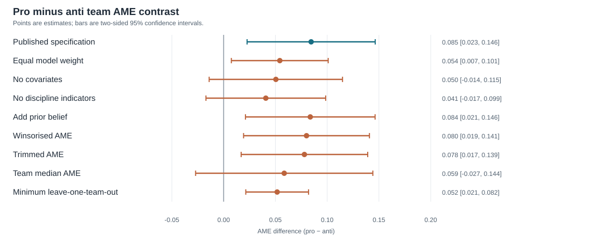

# Reproduction and sensitivity analysis: Borjas and Breznau (2026)

**Prepared by Codex GPT-6-Sol**

## Abstract

The adjusted pro-minus-anti-immigration team AME difference is 0.085 (95% CI 0.023 to 0.146), matching the published result. All eight predeclared alternative estimates remain positive, but only 5 have 95% intervals excluding zero. The association is consistent in direction, while its precision depends on defensible analysis choices and does not establish causation.

## Robustness choices recorded before estimation

The fixed question is whether teams classified as pro-immigration produce higher average marginal effect (AME) estimates than teams classified as anti-immigration. I will report the adjusted pro-minus-anti contrast from Table 1, column 3, and compare the same contrast under eight defensible alternatives. For the sensitivity exercise, I will call the direction stable if the contrast remains positive, and the inferential conclusion stable if its two-sided 95% confidence interval excludes zero. These choices and expectations were written before running the reproduction or robustness models.

| Alternative choice | Reason an analyst might choose it | Expected effect on the headline conclusion, before estimation |
|---|---|---|
| 1. Give each reported model equal weight instead of each team equal total weight. | Treat every submitted specification as evidence, irrespective of team. | **May change it** because teams submitted very different numbers of models. |
| 2. Omit all covariates and estimate the raw pro-minus-anti difference. | Describe the observed association without model-based adjustment. | **May change it** because ideology and team characteristics may covary. |
| 3. Keep skill, topic experience, and team size but omit discipline indicators. | Avoid many indicators with only 71 independent teams. | **May change it** if discipline strongly confounds the association. |
| 4. Add the team's prior belief about the hypothesis. | Account for a related pre-analysis attitude. | Unlikely to change it materially, based on the paper's own supplementary result. |
| 5. Winsorise the model-level AME at its pooled 1st and 99th percentiles. | Reduce the influence of extreme submitted estimates while retaining all models. | **May change it** if the tails drive the mean. |
| 6. Trim model-level AMEs outside those same pooled percentile cutoffs, then recalculate inverse model-count weights within teams. | Exclude the most extreme submitted estimates. | **May change it** for the same reason; the number of retained teams will be checked. |
| 7. Replace each team's mean AME with its median and regress the 71 team medians on the baseline covariates. | Describe a team's typical rather than average submitted finding. | **May change it** if a few within-team results drive team means. |
| 8. Refit the baseline after deleting each team in turn, and report the smallest pro-minus-anti contrast. | Check dependence on any single team, especially among nine anti-immigration teams. | **May change it**, particularly its confidence interval. The deletion rule is fixed here, before inspecting influence. |

## Main result

I used the supplied `data/df.dta` and reproduced the nine key Table 1 estimates. The input has 1,253 usable model records from 71 teams: 9 anti-immigration, 31 moderate, and 31 pro-immigration teams. One extra `.dta` record has no team ID or AME and is excluded. Table 1 regressions give each team equal total weight and cluster standard errors by team. The negative and positive tail outcomes use the indicators already supplied in the dataset.

| Outcome | Ideology contrast | Published estimate (SE) | Reproduced estimate (SE) | Reproduced 95% CI | Published source |
|---|---|---:|---:|---:|---|
| AME | Mean sentiment, per scale point | 0.011 (0.006) | 0.011 (0.006) | [0.000, 0.022] | [Paper PDF, Table 1, col. 1](https://gborjas.scholars.harvard.edu/sites/g/files/omnuum4696/files/2026-01/sciadv.adz7173_0.pdf) |
| AME | Pro minus anti team fraction | 0.074 (0.024) | 0.074 (0.024) | [0.025, 0.122] | [Paper PDF, Table 1, col. 2](https://gborjas.scholars.harvard.edu/sites/g/files/omnuum4696/files/2026-01/sciadv.adz7173_0.pdf) |
| AME | Pro minus anti team category | 0.085 (0.031) | 0.085 (0.031) | [0.023, 0.146] | [Paper PDF, Table 1, col. 3](https://gborjas.scholars.harvard.edu/sites/g/files/omnuum4696/files/2026-01/sciadv.adz7173_0.pdf) |
| Negative tail | Mean sentiment, per scale point | -0.051 (0.021) | -0.051 (0.021) | [-0.093, -0.010] | [Paper PDF, Table 1, col. 4](https://gborjas.scholars.harvard.edu/sites/g/files/omnuum4696/files/2026-01/sciadv.adz7173_0.pdf) |
| Negative tail | Pro minus anti team fraction | -0.242 (0.107) | -0.242 (0.107) | [-0.456, -0.027] | [Paper PDF, Table 1, col. 5](https://gborjas.scholars.harvard.edu/sites/g/files/omnuum4696/files/2026-01/sciadv.adz7173_0.pdf) |
| Negative tail | Pro minus anti team category | -0.274 (0.125) | -0.274 (0.125) | [-0.524, -0.024] | [Paper PDF, Table 1, col. 6](https://gborjas.scholars.harvard.edu/sites/g/files/omnuum4696/files/2026-01/sciadv.adz7173_0.pdf) |
| Positive tail | Mean sentiment, per scale point | 0.019 (0.012) | 0.019 (0.012) | [-0.004, 0.042] | [Paper PDF, Table 1, col. 7](https://gborjas.scholars.harvard.edu/sites/g/files/omnuum4696/files/2026-01/sciadv.adz7173_0.pdf) |
| Positive tail | Pro minus anti team fraction | 0.114 (0.045) | 0.114 (0.046) | [0.023, 0.206] | [Paper PDF, Table 1, col. 8](https://gborjas.scholars.harvard.edu/sites/g/files/omnuum4696/files/2026-01/sciadv.adz7173_0.pdf) |
| Positive tail | Pro minus anti team category | 0.087 (0.035) | 0.087 (0.035) | [0.018, 0.156] | [Paper PDF, Table 1, col. 9](https://gborjas.scholars.harvard.edu/sites/g/files/omnuum4696/files/2026-01/sciadv.adz7173_0.pdf) |

The AME category contrast is the headline comparison: pro-immigration teams have higher adjusted AMEs than anti-immigration teams. All nine point estimates agree with the paper at three decimal places. Eight of nine standard errors do too; for the positive-tail team-fraction contrast (column 8), the paper prints 0.045, while the package's `code/Log Files/02_Main_Regs.log` gives 0.0458145 and this calculation rounds to 0.046. The tail results are linear probability contrasts; a value of 0.087 represents 8.7 percentage points.

## Robustness of the AME category contrast

| Analysis | Pro minus anti | SE | 95% CI | Two-sided p | Teams | Models |
|---|---:|---:|---:|---:|---:|---:|
| Published specification | 0.085 | 0.031 | [0.023, 0.146] | 0.008 | 71 | 1,253 |
| Equal model weight | 0.054 | 0.023 | [0.007, 0.101] | 0.024 | 71 | 1,253 |
| No covariates | 0.050 | 0.032 | [-0.014, 0.115] | 0.123 | 71 | 1,253 |
| No discipline indicators | 0.041 | 0.029 | [-0.017, 0.099] | 0.164 | 71 | 1,253 |
| Add prior belief | 0.084 | 0.031 | [0.021, 0.146] | 0.010 | 71 | 1,253 |
| Winsorised AME | 0.080 | 0.030 | [0.019, 0.141] | 0.011 | 71 | 1,253 |
| Trimmed AME | 0.078 | 0.031 | [0.017, 0.139] | 0.013 | 71 | 1,227 |
| Team median AME | 0.059 | 0.043 | [-0.027, 0.144] | 0.176 | 71 | 71 |
| Minimum leave-one-team-out | 0.052 | 0.015 | [0.021, 0.082] | 0.001 | 70 | 1,251 |

[Open the figure at full size](robustness.svg)

The pooled AME cutoffs for winsorisation and trimming are -0.544 and 0.580. Across all 71 single-team deletions, the contrast ranges from 0.052 to 0.101; 71 remain positive and 71 have 95% intervals above zero. The minimum occurs on deleting team 42 (anti-immigration). Each trimmed team's weight was recalculated as the inverse of its retained model count. The median analysis uses one record per team and HC3 standard errors; other rows use model-level weighted least squares and team-clustered standard errors.

## Analysis decisions left open by the paper

- I chose Table 1's AME category contrast as the numerical headline. The paper also emphasises the continuous ideology and tail outcomes, reproduced above.

- I began with the package's prepared `df.dta` rather than rebuilding it from the raw survey and model files. Thus, this reproduction accepts its team classification, skill and topic scores, discipline coding, and imputations. For the tail models, I used the package's existing indicators rather than reconstructing percentiles and significance tests.

- I excluded the record without a team ID or AME to match the paper's analysis sample. The supplied `nmodel` matches the actual number of model records per team.

- To implement the paper's weighted regressions in Python, I used weighted least squares, the lowest observed `mdegree` code as the categorical reference, a finite-sample cluster covariance correction, and t critical values with teams minus one degrees of freedom. The reference code affects individual discipline coefficients but not the reported ideology contrasts.

- I set a two-sided 95% interval as the threshold for the sensitivity conclusion and set the pooled, unweighted model-level 1st and 99th percentiles as the cutoffs for trimming and winsorisation. Within trimmed data I recalculated team weights. For team medians I used HC3 intervals.

- The prespecified deletion diagnostic reports the smallest pro-minus-anti contrast across single-team removals; its p value is descriptive rather than a new confirmatory test.

## Reproducibility and interpretation

Run `python3 reproduce.py` from a clean Python session with `pandas`, `numpy`, `scipy`, `statsmodels`, and `pyreadstat` installed, plus Pandoc for HTML conversion. The script reads only `data/df.dta` and writes `report.md`, `report.html`, and `robustness.svg`. The nine published numbers and standard errors in the comparison table are transcribed from the paper PDF; all reproduced and sensitivity estimates, intervals, p values, sample counts, cutoffs, and figure coordinates are computed by this script.

## Conclusion

The adjusted pro-minus-anti AME difference reproduces the published result at its reported precision, and its direction stays positive in 9 of 9 specifications. The two-sided 95% interval excludes zero in 6 of 9 specifications (5 of eight alternatives), so the strength of evidence depends on reasonable analysis choices. These are observational associations across teams, with only nine anti-immigration teams, and do not by themselves establish that ideology caused the different estimates.
