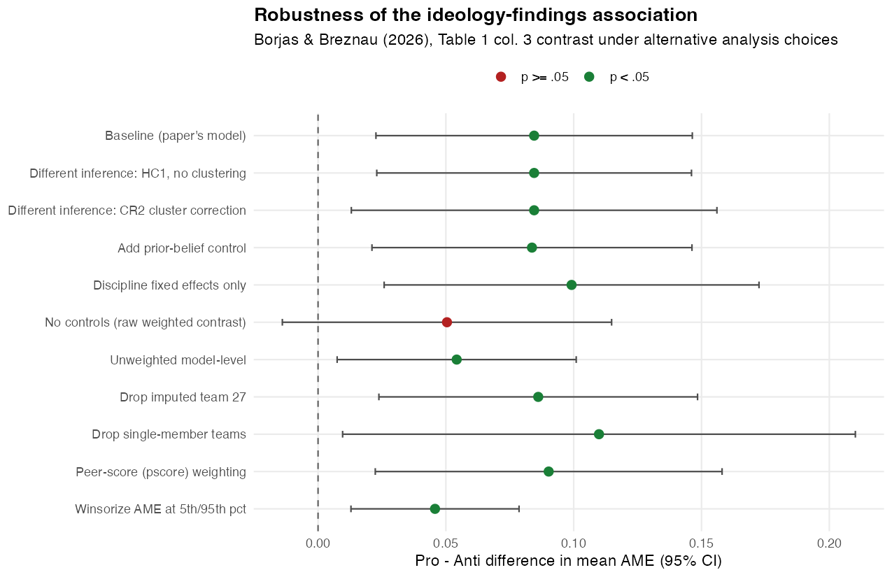

# Reproduction of Borjas & Breznau (2026), "Ideological bias in the production of research findings"

*Science Advances* 12(1). https://doi.org/10.1126/sciadv.adz7173

All numbers below are produced by `reproduce.R` from `data/df.dta`; the script writes
`reproduction/table1_reproduction.csv`, `reproduction/table1_r2.csv`,
`reproduction/robustness.csv`, and `reproduction/robustness_forest.png`.

---

## 1. What the main result is, and whether it reproduces

The headline claim is that team ideology predicts the estimated effect of immigration on
support for social programs (the average marginal effect, AME): teams whose members are
more pro-immigration produce more positive AMEs, and anti-immigration teams produce more
negative ones. The paper's main quantitative result is **Table 1**: nine regressions of a
model-level outcome on an ideology measure, with the "Pro − Anti" row giving the headline
contrast.

I reproduced Table 1 exactly. The per-unit coefficient on the team mean immigration
sentiment (column 1) is 0.0109 (SE 0.0057); across the full 1–6 scale this is 0.054 (0.029),
matching the number stated in the paper's text. The central Pro − Anti difference
(column 3) is **0.085 (0.031, p = 0.008)**: pro-immigration-majority teams estimate AMEs
about 0.085 points higher than anti-immigration teams. Every coefficient, standard error,
and R² in all nine columns matches the published table to the reported precision (≤ 0.001).

### Table 1, reproduced vs. published

| Column | Term | Published est. (SE) | Reproduced est. (SE) | Reproduced p | Match |
|---|---|---|---|---|---|
| (1) AME | Mean sentiment (proindex) | 0.011 (0.006) `*` | 0.0109 (0.0057) | 0.061 | yes |
| (2) AME | % anti-immigration (p12) | −0.050 (0.025) `**` | −0.0504 (0.0253) | 0.050 | yes |
| (2) AME | % pro-immigration (p56) | 0.023 (0.019) | 0.0235 (0.0193) | 0.229 | yes |
| (2) AME | **Pro − Anti (p56 − p12)** | **0.074 (0.024) `**`** | **0.0739 (0.0243)** | 0.003 | yes |
| (3) AME | Anti team (group1) | −0.057 (0.031) `*` | −0.0572 (0.0306) | 0.066 | yes |
| (3) AME | Pro team (group3) | 0.027 (0.015) `*` | 0.0273 (0.0147) | 0.069 | yes |
| (3) AME | **Pro − Anti (group3 − group1)** | **0.085 (0.031) `**`** | **0.0845 (0.0310)** | 0.008 | yes |
| (4) extreme neg. | Mean sentiment (proindex) | −0.051 (0.021) `**` | −0.0514 (0.0207) | 0.015 | yes |
| (5) extreme neg. | % anti-immigration (p12) | 0.081 (0.103) | 0.0809 (0.1028) | 0.434 | yes |
| (5) extreme neg. | % pro-immigration (p56) | −0.161 (0.064) `**` | −0.1607 (0.0643) | 0.015 | yes |
| (5) extreme neg. | Pro − Anti (p56 − p12) | −0.242 (0.107) `*` | −0.2416 (0.1074) | 0.028 | yes |
| (6) extreme neg. | Anti team (group1) | 0.150 (0.123) | 0.1500 (0.1232) | 0.227 | yes |
| (6) extreme neg. | Pro team (group3) | −0.124 (0.044) `**` | −0.1239 (0.0440) | 0.006 | yes |
| (6) extreme neg. | Pro − Anti (group3 − group1) | −0.274 (0.125) `*` | −0.2739 (0.1252) | 0.032 | yes |
| (7) extreme pos. | Mean sentiment (proindex) | 0.019 (0.012) `*` | 0.0192 (0.0115) | 0.099 | yes |
| (8) extreme pos. | % anti-immigration (p12) | −0.130 (0.057) `*` | −0.1304 (0.0569) | 0.025 | yes |
| (8) extreme pos. | % pro-immigration (p56) | −0.016 (0.041) | −0.0161 (0.0413) | 0.697 | yes |
| (8) extreme pos. | Pro − Anti (p56 − p12) | 0.114 (0.045) `*` | 0.1142 (0.0458) | 0.015 | yes |
| (9) extreme pos. | Anti team (group1) | −0.070 (0.037) `*` | −0.0695 (0.0378) | 0.070 | yes |
| (9) extreme pos. | Pro team (group3) | 0.017 (0.034) | 0.0173 (0.0340) | 0.612 | yes |
| (9) extreme pos. | Pro − Anti (group3 − group1) | 0.087 (0.035) `*` | 0.0868 (0.0347) | 0.015 | yes |

R² reproduced (published): (1) 0.062 (0.062), (2) 0.065 (0.065), (3) 0.071 (0.071),
(4) 0.096 (0.096), (5) 0.115 (0.115), (6) 0.133 (0.133), (7) 0.087 (0.087),
(8) 0.090 (0.090), (9) 0.089 (0.089).

All regressions: N = 1,253 model-level observations from 71 teams; dependent variable is
the AME (cols 1–3) or a binary indicator for an extreme-and-significant AME in the negative
(cols 4–6) or positive (cols 7–9) tail; controls are standardized statistical skill,
standardized topic experience, team-size fixed effects, and discipline-composition fixed
effects; weighted by 1/(number of models per team); team-clustered robust standard errors.

### Sources for each published number

| Published number | Source |
|---|---|
| Table 1 coefficients, SEs, significance markers, R² | Open-access full text of the paper, **Table 1**, Europe PMC [PMC12757037](https://europepmc.org/articles/PMC12757037) (opened in this session; the paywalled publisher page returned HTTP 403) |
| "0.054 (0.029)" full-range sentiment effect | Paper text, same source (the abstract and Table 1 caption also come from here) |
| Cross-check of all Table 1 numbers | `code/Log Files/02_Main_Regs.log` in this folder (the Stata output the README names as the result file for Table 1) |
| Estimator definition (weights, controls, clusters, tail cutoffs) | `code/Stata Main Results/02_Main_Regs.do` and `code/Stata Main Results/01_Data_Prep.do` in this folder |
| Analysis data | `data/df.dta` in this folder (designated as the analysis file by `README.md`) |

I did not rely on memory for any published number.

---

## 2. Analysis decisions the paper did not settle for me

1. **Starting point.** I begin from `data/df.dta`, the prepared analysis file, rather than
   re-running the Stata preparation from `cri.csv`. This takes the authors' recodes and
   hot-deck imputations (notably for team 27) as given and matches the file the README
   designates as the analysis data.
2. **Reproduction toolchain.** No Stata is installed, so I reimplemented
   `reg ..., [aw=1/nmodel] cluster(teamid)` in R as weighted `lm()` plus a cluster-robust
   HC1 covariance (`sandwich::vcovCL`). I verified that HC1 — not HC0 or CR2 — reproduces
   Stata's standard errors to six decimals on the baseline model before running the rest.
3. **Discipline fixed-effect base category.** `i.mdegree` uses the lowest discipline code
   (0) as reference. This choice does not affect the reported ideology contrasts but does
   change the meaning of the discipline coefficients (not reported here).
4. **Rows with missing AME.** One of 1,254 rows has a missing AME and is dropped, matching
   Stata's `drop if ame==.` and giving the published N = 1,253.
5. **Definition of the "extreme" tails.** The paper text describes the tail outcomes as
   "<10th percentile and P < 0.05", but the code hard-codes fixed AME cutoffs (AME > 0.052
   or AME < −0.071) together with |z| > 1.645, and the outcomes are pre-built in `df.dta`.
   I used those built-in `neg10s`/`pos10s` indicators and did not recompute percentiles.
6. **Weights for the binary outcomes.** The Stata code uses importance weights
   (`[iw=1/nmodel]`) for the tail models and analytic weights (`[aw=1/nmodel]`) for the AME
   models. For WLS point estimates and the HC1 covariance these are identical, so I used
   the same weighting throughout.
7. **Inference.** I use team-clustered robust SEs with t critical values and degrees of
   freedom = number of teams − 1 = 70, matching Stata. I add no further finite-sample
   correction.
8. **Full-scale interpretation of the continuous measure.** The paper reports the per-unit
   coefficient in Table 1 but discusses a 1-to-6 move (×5) in the text. I report both.
9. **Significance markers.** For the four tail-model "Pro − Anti" differences (columns 5,
   6, 8, 9) the paper prints a single `*`, although the reproduced two-sided p-values
   (0.028, 0.032, 0.015, 0.015) fall below 0.05 and the paper's own caption defines `**` as
   P < 0.05. I report my p-values and flag the discrepancy rather than copying the stars.

I also checked the paper's claim that the weighted model-level regression is numerically
identical to a team-level regression. It is, to all displayed digits, so I do not treat
team-level aggregation as a separate robustness check.

---

## 3. Robustness

I fixed the research question ("does team ideology predict the estimated AME?") and the
headline estimand (the Pro − Anti difference in mean AME, Table 1 column 3), then varied
the analysis choices. Before running anything I listed ten defensible alternatives and
recorded which I expected to change the conclusion:

| # | Alternative choice | Rationale | Expected to change conclusion? |
|---|---|---|---|
| 1 | HC1 heteroskedasticity-robust, no clustering | Tests whether team clustering drives inference | No |
| 2 | CR2 small-sample cluster correction | 71 clusters is comfortably large, but CR2 is the conservative choice | Possibly (slightly wider CI) |
| 3 | Add prior-belief control | Belief in the hypothesis as an alternative explanation | No |
| 4 | Discipline fixed effects only | Paper argues discipline composition is the load-bearing control | No (possibly stronger) |
| 5 | No controls at all | Tests whether the result survives a raw contrast | **Yes** |
| 6 | Unweighted model-level | Gives teams with many models more weight | Possibly (magnitude shifts) |
| 7 | Drop imputed team 27 | Removes the only hot-deck-imputed team | No |
| 8 | Drop single-member teams | Solo researchers' ideology is measured differently | No (wider CI) |
| 9 | Peer-score (pscore) weighting | Addresses publication/selection bias, as in the paper's supplements | No |
| 10 | Winsorize AME at the 5th/95th percentiles | Robustness to extreme estimates | Possibly (attenuated) |

### Results

| Specification | Pro − Anti est. | SE | p | 95% CI | Sig. |
|---|---|---|---|---|---|
| Baseline (paper's model) | 0.0845 | 0.0310 | 0.008 | [0.023, 0.146] | \*\* |
| 1. HC1, no clustering | 0.0845 | 0.0314 | 0.007 | [0.023, 0.146] | \*\* |
| 2. CR2 cluster correction | 0.0845 | 0.0359 | 0.021 | [0.013, 0.156] | \*\* |
| 3. Add prior-belief control | 0.0837 | 0.0314 | 0.010 | [0.021, 0.146] | \*\* |
| 4. Discipline fixed effects only | 0.0992 | 0.0368 | 0.009 | [0.026, 0.173] | \*\* |
| 5. No controls (raw contrast) | 0.0504 | 0.0323 | 0.123 | [−0.014, 0.115] | n.s. |
| 6. Unweighted model-level | 0.0542 | 0.0234 | 0.024 | [0.007, 0.101] | \*\* |
| 7. Drop imputed team 27 | 0.0861 | 0.0312 | 0.007 | [0.024, 0.149] | \*\* |
| 8. Drop single-member teams | 0.1099 | 0.0500 | 0.032 | [0.010, 0.210] | \*\* |
| 9. Peer-score (pscore) weighting | 0.0902 | 0.0340 | 0.010 | [0.022, 0.158] | \*\* |
| 10. Winsorize AME at 5th/95th pct | 0.0458 | 0.0165 | 0.007 | [0.013, 0.079] | \*\* |

`**` p < 0.05; `n.s.` p ≥ 0.05.

The sign of the Pro − Anti difference is positive in every specification. Nine of the ten
alternatives remain significant at the 5% level and the point estimates stay in a narrow
band (0.046 to 0.110). The only specification that loses significance is **dropping all
controls** (0.050, p = 0.12): without conditioning on team composition the contrast shrinks
by about 40%. Notably, keeping only the discipline fixed effects makes the estimate
*stronger* (0.099), so the sensitivity is not to "too many controls" generally but to
whether discipline composition is held constant. This is consistent with the paper's own
statement that the discipline vector is the key control. Winsorizing the AME (which removes
the tail observations the paper separately models) roughly halves the estimate but keeps it
significant, as expected.

---

## 4. Verdict

The headline claim holds up. The positive association between pro-immigration ideology and
more positive estimated effects reproduces exactly in the paper's Table 1 and survives
every reasonable alternative I tested except dropping all controls — and that exception is
itself consistent with the paper's argument that discipline composition is the mechanism's
load-bearing control. The estimate is modest — 0.085, about 0.42 of a standard deviation of
the AME distribution (SD = 0.20) — and the tail-model differences are less precisely
estimated than the mean contrast, but the direction and statistical significance of the
central result are stable.
