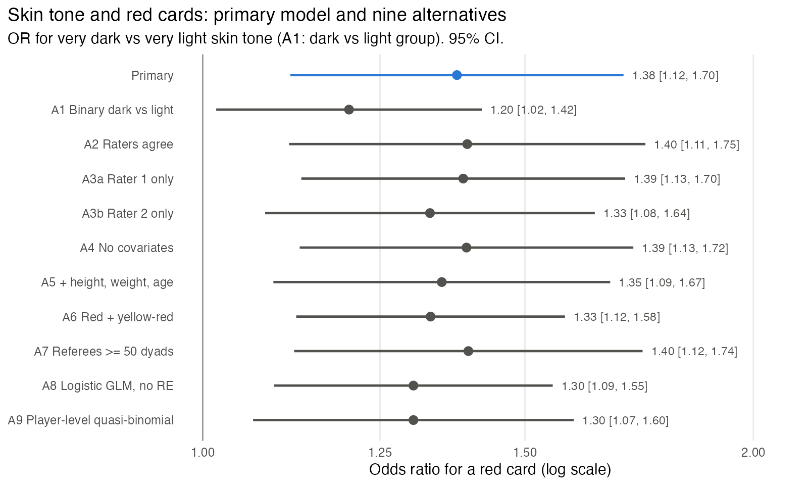
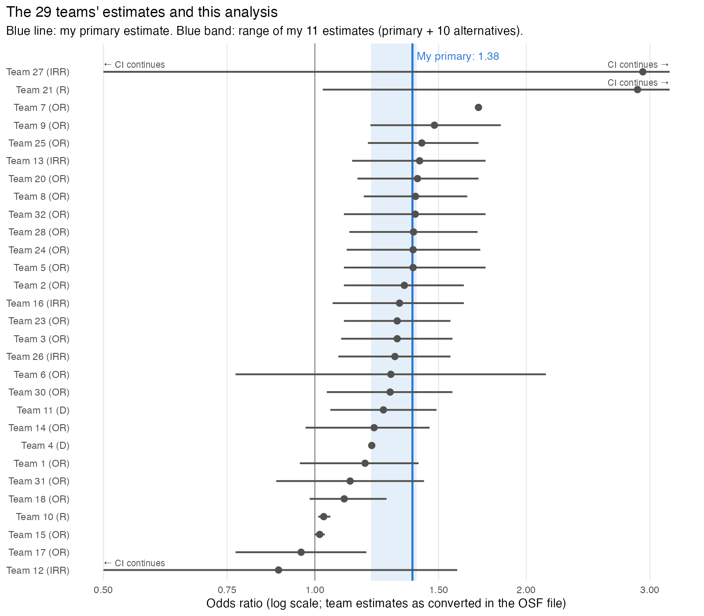

# Skin tone and red cards: re-analysis of the Silberzahn et al. (2018) dataset

**Answer.** Yes. In this dataset, players rated very dark-skinned receive red cards at higher odds than players rated very light-skinned: **OR = 1.38, 95% CI [1.12, 1.70]** (p = .003), conditional on position and league, with crossed random effects for player and referee. Ten alternative specifications give ORs from 1.20 to 1.40; all their 95% CIs exclude 1. The data show an association. They cannot show that referees cause it.

Files in this folder:

| File | Content |
|---|---|
| `analysis.R` | Primary analysis (step 1). Writes `primary_estimate.csv` |
| `robustness_plan.md` | Alternatives and predictions, written before any alternative was fitted |
| `robustness.R` | Alternatives A1–A9. Writes `robustness_estimates.csv`, `robustness_forest.png` |
| `compare_teams.R` | Comparison with the 29 teams. Uses `teams_estimates_osf.csv`, writes `teams_comparison.png` |

To reproduce: `Rscript analysis.R && Rscript robustness.R && Rscript compare_teams.R` (R 4.x with data.table, glmmTMB, ggplot2). The primary model takes about 5 min. The robustness script fits 8 mixed models in parallel and takes about 12 min on 10 cores.

## 1. Primary analysis

### Data

- 146,028 player–referee dyads; 2,053 players; 3,147 referees.
- 1,585 players have skin-tone ratings from both raters. The README says 1,586 photos; the data contain ratings for 1,585 players.
- The analysis sample is the 124,621 dyads of rated players: 373,067 games, 1,589 red cards (4.3 per 1,000 games), 2,978 referees.

Raw red-card rate by mean skin-tone rating (per 1,000 games):

| Mean rating | 0 (very light) | 0.125 | 0.25 | 0.375 | 0.5 | 0.625 | 0.75 | 0.875 | 1 (very dark) |
|---|---|---|---|---|---|---|---|---|---|
| Players | 424 | 227 | 472 | 77 | 116 | 33 | 104 | 40 | 92 |
| Red cards / 1,000 games | 3.8 | 3.7 | 4.4 | 5.2 | 4.9 | 2.3 | 4.8 | 5.0 | 5.1 |

### Model

Binomial generalised linear mixed model (GLMM), logit link, fitted with glmmTMB (Laplace approximation):

- **Outcome.** Red cards out of games in each dyad, `cbind(redCards, games - redCards)`.
- **Predictor.** Skin tone = mean of the two raters' codes, on the 0–1 scale (0 = very light, 1 = very dark), entered as linear.
- **Controls.** Player position (12 positions, plus "Missing" as its own level for 17,726 dyads), league country.
- **Random effects.** Crossed random intercepts for player and for referee.

Justification:

- Red cards are rare (0.4% of games). The binomial model with games as trials uses the exposure in each dyad directly.
- Dyads are not independent. The same player appears with many referees, and the same referee with many players. Crossed random intercepts account for both. They also absorb stable differences between players (playing style) and between referees (strictness).
- Position changes how often a player commits fouls that draw cards, and it can differ by skin tone. League country fixes the competition a player plays in. Both are fixed before any referee decision, so neither is a consequence of referee bias.
- In-dyad variables (yellow cards, goals, wins, losses) are left out. They are outcomes of the same matches and can be affected by the same referee behaviour.

### Result

| Term | Estimate (log-odds) | SE | OR | 95% CI (Wald) | p |
|---|---|---|---|---|---|
| Skin tone (0 → 1) | 0.320 | 0.107 | **1.38** | **[1.12, 1.70]** | .003 |

- The OR compares a player rated very dark (both raters: 5) with a player rated very light (both raters: 1). One step on a rater's 5-point scale is a quarter of this contrast (OR ≈ 1.38^0.25 = 1.08).
- Random-effect SDs (logit scale): player 0.52, referee 0.34. Both are well above zero.
- The model converged with a positive-definite Hessian.

## 2. Analysis decisions the question and data did not settle

1. **Unit of analysis.** Player–referee dyads, with games as binomial trials. This assumes games within a dyad are exchangeable given the random effects.
2. **Outcome.** Direct red cards only. Yellow-red cards (second yellows) are excluded.
3. **Skin-tone measure.** Mean of the two raters, not one rater, not a consensus rule.
4. **Functional form.** Skin tone is linear on the log-odds scale, not categorical.
5. **Effect contrast.** OR for the full scale (very dark vs very light). The question says "dark vs light" and does not define the groups.
6. **Players without photos.** The 468 unrated players (21,407 dyads) are excluded. There is no way to impute skin tone from the other variables.
7. **Covariates.** Position and league country. Height, weight and age are not in the primary model.
8. **Missing position.** Coded as its own level so that those 17,726 dyads stay in the model.
9. **Outcome-adjacent variables.** Yellow cards, goals, victories, ties and defeats are excluded as controls.
10. **Random-effects structure.** Random intercepts for player and referee only. No random slope for skin tone across referees. No level for referee country.
11. **Referee inclusion.** All referees are kept, including the many who appear in only a few dyads (median 8 dyads per referee in the full data).
12. **Implicit and explicit bias variables.** Not used. They address a different question (whether bias in the referee's country moderates the effect).
13. **Estimation and inference.** Maximum likelihood with Laplace approximation; Wald CI on the log-odds scale; α = .05.
14. **Interpretation.** The estimate is an association between rated skin tone and red cards. The data contain no measure of player behaviour (fouls committed, severity), so the estimate is not a direct measure of referee bias.

## 3. Robustness

### Plan

The alternatives, their rationale and my predictions are in `robustness_plan.md`. I wrote that file before any alternative was fitted and before the primary estimate was available.

**Definition of a changed conclusion.** An alternative changes the conclusion if its OR is on the other side of 1 from the primary OR, or its 95% CI stands in a different relation to 1 (the primary CI excludes 1).

| # | Alternative | Predicted to change the conclusion? |
|---|---|---|
| A1 | Binary skin tone: dark (mean rating > 0.5) vs light (< 0.5); neutral players dropped | **Maybe** (smaller contrast, less power) |
| A2 | Only players whose two raters agree | No |
| A3a / A3b | Rater 1 only / rater 2 only | No |
| A4 | No covariates | No |
| A5 | Add height, weight, age (complete cases) | No |
| A6 | Outcome = red + yellow-red cards | No |
| A7 | Only referees with ≥ 50 dyads | No |
| A8 | Ordinary logistic regression, no random effects | No (narrower CI expected) |
| A9 | Player-level aggregation, quasi-binomial GLM | **Maybe** (fewer units, wider CI) |

### Results

| Model | OR | 95% CI | p | Dyads | Players | Prediction met? |
|---|---|---|---|---|---|---|
| **Primary** | **1.38** | **[1.12, 1.70]** | .003 | 124,621 | 1,585 | – |
| A1 Binary dark vs light | 1.20 | [1.02, 1.42] | .031 | 115,632 | 1,469 | Smaller OR, as predicted. Conclusion unchanged; lower bound close to 1 |
| A2 Raters agree | 1.40 | [1.11, 1.75] | .004 | 95,714 | 1,206 | Yes: similar OR, wider CI |
| A3a Rater 1 only | 1.39 | [1.13, 1.70] | .002 | 124,621 | 1,585 | Yes |
| A3b Rater 2 only | 1.33 | [1.08, 1.64] | .007 | 124,621 | 1,585 | Yes |
| A4 No covariates | 1.39 | [1.13, 1.72] | .002 | 124,621 | 1,585 | Yes |
| A5 + height, weight, age | 1.35 | [1.09, 1.67] | .005 | 123,868 | 1,564 | Yes |
| A6 Red + yellow-red | 1.33 | [1.12, 1.58] | < .001 | 124,621 | 1,585 | Yes: OR slightly closer to 1 |
| A7 Referees ≥ 50 dyads | 1.40 | [1.12, 1.74] | .003 | 102,662 | 1,584 | Yes |
| A8 Logistic GLM, no RE | 1.30 | [1.09, 1.55] | .003 | 124,621 | 1,585 | Yes: narrower CI; OR 0.07 lower |
| A9 Player-level quasi-binomial | 1.30 | [1.07, 1.60] | .010 | – | 1,585 | Conclusion unchanged, against the "maybe" |

Notes:

- **No alternative changed the conclusion.** All 11 ORs lie between 1.20 and 1.40. All 11 CIs exclude 1.
- **A1 measures a different contrast.** The mean rating of the dark group is 0.84 and of the light group 0.15, so the groups are about 0.7 scale units apart. On the primary model's linear scale, that gap corresponds to OR ≈ 1.38^0.7 = 1.25. The observed 1.20 is close to this.
- **A9 has the same point estimate as A8.** A binomial GLM whose predictors are all player-level gives identical coefficients on dyad-level and player-level data. A9 therefore tests only the variance assumption. Its dispersion is 1.32, which widens the CI relative to A8.
- **The models without random effects (A8, A9) give lower ORs** (1.30 vs 1.38). A plausible reason, which I did not test: without random effects every game counts equally, so players and referees with many games carry more weight.
- **Scope of this check.** All alternatives use the same ratings and the same observational data. None of them tests the causal step from "more red cards" to "referee bias".

## 4. Comparison with the 29 teams

Source: `https://osf.io/download/fa743/`, downloaded in this session after steps 1–3 were complete. The file has one row per team, with each team's estimate, its units (`OR`, `IRR`, `D`, `R`) and a conversion to the OR scale (`OR`, `OR_lo`, `OR_hi`). All numbers below are computed from that file by `compare_teams.R`.

- **Units.** 20 teams reported ORs, 5 incidence-rate ratios, 2 Cohen's d and 2 correlations. The OSF file converts all of them to ORs. I use the converted values as given.
- **Distribution.** Median OR 1.31; range 0.89 (team 12) to 2.93 (team 27).
- **Significance.** 20 of 29 teams have a 95% CI lower bound above 1.
- **My primary estimate (1.38).** 17 teams report a lower OR, 2 report 1.38 (teams 5 and 24), 10 report a higher OR. Its CI [1.12, 1.70] is close to the CIs of teams 5 (1.38 [1.10, 1.75]), 24 (1.38 [1.11, 1.72]) and 28 (1.382 [1.12, 1.705]). The file lists these three teams as using mixed-effects or multilevel models.
- **My 11 estimates (1.20–1.40).** 15 of the 29 team estimates fall inside this range. Seven teams are below it (0.89–1.18) and seven above it (1.40–2.93). Four of the seven above are multilevel count or logistic models just past my range (1.40–1.48). The three far above are Dirichlet process clustering (1.71), Tobit regression (2.88) and Poisson regression (2.93, CI 0.11–78.7).

Caveat: the OSF file does not record which skin-tone contrast each team estimated (full 0–1 scale, per rater step, or a binary split). Teams that used a binary split or a different scaling are not strictly comparable with my 0–1 OR, and the placement above is approximate for them.

The following is from my memory of the paper (Silberzahn et al., 2018, https://doi.org/10.1177/2515245917747646), which I did not open in this session. The paper reports estimates from 0.89 to 2.93, a median of 1.31, and 20 of 29 teams with a significant positive effect. These match the file. The numbers in the list above come from the OSF file, not from memory.

## 5. Conclusion

In these data, dark-skin-toned players receive more red cards than light-skin-toned players. The OR is about 1.3–1.4 for the full very-light to very-dark contrast, and it holds across every alternative specification I tested. The estimate sits in the middle of the 29 teams' results and matches the teams that fitted similar mixed-effects models. The data cannot separate referee bias from differences in player behaviour, so the evidence supports a disparity in red cards, not a cause.
