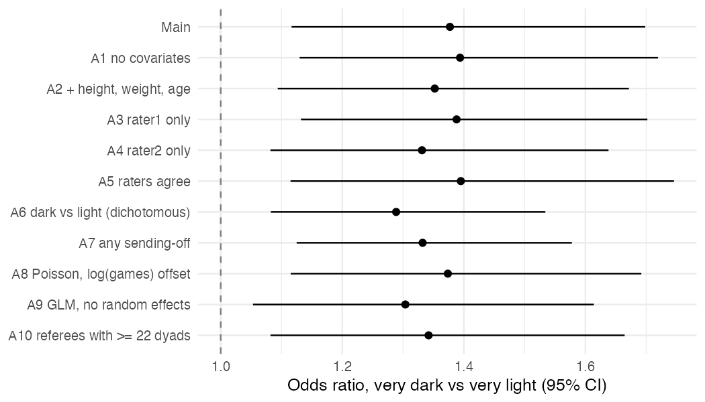
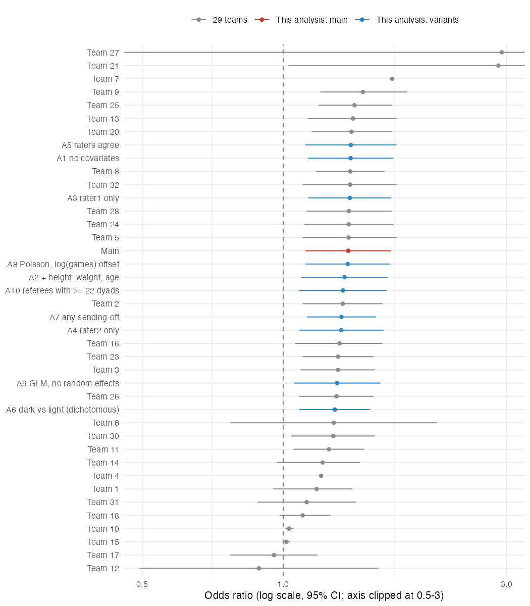

# Skin tone and red cards: one analysis and its robustness

Files: `analysis.R` (main model + variants → `results_own.csv`, `fig_robustness.png`; about 18 min on 6 cores),
`teams.R` (comparison with the 29 teams → `fig_teams.png`), `robustness_plan.md` (variant list and expectations, written before any model ran).
Run from a clean start with `Rscript analysis.R && Rscript teams.R`.

## 1. Main analysis

**Approach.** The outcome is the red-card count per player–referee dyad, out of `games` played together. I fit a binomial GLMM (logit link, `glmmTMB`). Skin tone is the mean of the two raters' scores (0 = very light, 1 = very dark). Fixed effects are player position and league country. Crossed random intercepts are included for player and for referee.

**Why this model.**
- Red cards are rare counts, bounded by the number of games. A binomial model with games as trials fits this directly.
- Dyads are not independent. The same player appears with many referees, and the same referee with many players. Crossed random intercepts take account of both, so the standard errors are not too small.
- Position affects exposure to fouls (defenders get more red cards), and skin tone may differ by position. League country accounts for differences in refereeing norms and in the player pool.
- I did not adjust for yellow cards. They are plausibly on the causal path between referee bias and red cards.

**Result.** For a very dark-skinned player compared with a very light-skinned player (the full 0→1 range of the scale), the odds of a red card per game are higher by **OR = 1.38, 95% CI [1.12, 1.70]**. This is based on 124,621 dyads and 1,585 players.

## 2. Decisions the question and data did not settle

1. **Estimand scale.** I report the OR for the full 0→1 range of the skin-tone scale (very light vs very dark), not the OR per rating step.
2. **Two raters.** I averaged them.
3. **Missing skin tone.** I dropped players without a photo or rating (complete cases, 21,407 dyads). I did not impute.
4. **Outcome.** Only direct red cards count. Second yellows (`yellowReds`) are excluded.
5. **Model family.** Binomial logit with games as trials, not Poisson, negative binomial or a linear model.
6. **Clustering.** Crossed random intercepts for player and referee. There are no random slopes, and there is no referee-country level.
7. **Covariates.** Position and league country only. Player size and age, club, and yellow cards were not included.
8. **Missing position** was coded as its own category ("Unknown"), so those rows were kept.
9. **No sample filtering** by referee or player (no minimum number of games or dyads).
10. **Referee bias measures** (IAT/explicit) were not used. They address a different question (moderation).

## 3. Robustness

The plan was written to `robustness_plan.md` before any model was run. It lists ten alternatives. My expectation was that none would change the direction of the result. A6 (dichotomising) and A10 (dropping referees with few dyads) could plausibly widen the CI so that it includes 1.

| Model | OR | 95% CI | Dyads | Players |
|---|---|---|---|---|
| **Main** | **1.38** | **1.12–1.70** | 124,621 | 1,585 |
| A1 No covariates | 1.39 | 1.13–1.72 | 124,621 | 1,585 |
| A2 + height, weight, age | 1.35 | 1.09–1.67 | 123,868 | 1,564 |
| A3 Rater 1 only | 1.39 | 1.13–1.70 | 124,621 | 1,585 |
| A4 Rater 2 only | 1.33 | 1.08–1.64 | 124,621 | 1,585 |
| A5 Raters agree exactly | 1.40 | 1.11–1.75 | 95,714 | 1,206 |
| A6 Dark (≥0.75) vs light (≤0.25), middle dropped | 1.29 | 1.08–1.53 | 107,606 | 1,359 |
| A7 Any sending-off (red + yellow-red) | 1.33 | 1.12–1.58 | 124,621 | 1,585 |
| A8 Poisson GLMM, log(games) offset (rate ratio) | 1.37 | 1.12–1.69 | 124,621 | 1,585 |
| A9 Logistic GLM, no random effects, player-clustered SEs | 1.30 | 1.05–1.61 | 124,621 | 1,585 |
| A10 Referees with ≥ 22 dyads | 1.34 | 1.08–1.66 | 112,484 | 1,584 |

- **Range.** The ORs range from 1.29 to 1.40, and every CI excludes 1. None of the ten variants changed the conclusion. This includes the two I flagged as risky (A6 and A10).
- **A6 is on a different scale.** It compares the two extreme groups, but the "dark" group includes 0.75 ratings, so its contrast is narrower than 0→1. Its lower OR is expected for that reason.
- **Limits of this check.** All variants share the complete-case sample and the same observational design. Unmeasured confounders would bias them all in the same way. Examples are playing style or aggression that correlates with skin tone within a position, or the player's nationality.
- **Figure note.** `fig_robustness.png` was drawn with `geom_errorbarh`. I then changed that line in `analysis.R` to the equivalent `geom_errorbar(orientation = "y")`, because the former is deprecated. I did not re-run the script after that cosmetic edit.

## 4. Comparison with the 29 teams

Source: `teams_estimates.csv`, downloaded in this session from https://osf.io/download/fa743/. I used its `OR`, `OR_lo` and `OR_hi` columns. For the teams that reported a different effect-size unit (d, r, IRR), these columns hold converted values. I did not check how the conversions were made.

- The teams' ORs have a median of 1.31 and range from 0.89 to 2.93.
- 20 of 29 teams' CIs exclude 1.
- My main estimate (1.38) is higher than 17 of the 29 team estimates. It lies within the central cluster of multilevel logistic and Poisson models (Teams 5, 24, 28 and 32 are all at 1.38–1.39).
- All my variants lie within the range 1.29–1.40, which is the middle of the team distribution.

I did not open the paper in this session. From memory only: the paper reports that 20 of 29 teams found a significant positive effect and that the estimates ranged from about 0.89 to 2.93. The downloaded file agrees with both figures.

## 5. Conclusion

In these data, dark-skin-toned players receive more red cards per game than light-skin-toned players, with an odds ratio of about 1.4 (95% CI 1.12–1.70) for the extremes of the scale. The estimate stays between 1.29 and 1.40 across ten defensible alternative choices, and it lies near the centre of the 29 teams' estimates. The data are observational, so this is a robust association rather than evidence that referee bias causes the difference.
