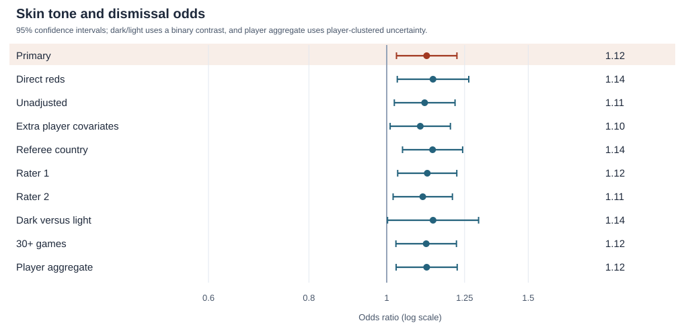

# Red cards and player skin tone

**Finding.** In the primary analysis, the adjusted odds ratio for a skin-tone rating of 0.75 versus 0.25 is 1.12 (95% CI 1.03–1.22). The nine planned alternatives point in the same direction. These data establish an association among rated players, not its cause.

## Analysis choices set before estimation

The primary outcome is any dismissal (`redCards + yellowReds`) per game in each player–referee dyad. I fit an aggregated binomial logistic regression, adjusting for player position (including a missing-position category) and league country. Skin tone is the mean of the two raters' scores. I report the odds ratio for a change from 0.25 to 0.75 on the 0–1 scale, with a 95% confidence interval that clusters observations by both player and referee. Players without ratings cannot contribute to the skin-tone comparison. The estimate is an association across players, not a causal effect of skin tone.

I fixed the following alternatives before fitting any model. Each changes one primary choice unless stated otherwise. A change in *conclusion* means a material change in direction or whether the 95% interval includes 1; small shifts in estimates or interval width do not count.

| Alternative | Defensible reason | Expected effect on conclusion |
|---|---|---|
| Direct red cards only | Exclude second-yellow dismissals, which may reflect a different decision process | Could change it |
| No position or league adjustment | Describe the overall observed association without controlling for recorded player context | Could change it |
| Add age, height, and weight | Account for further observed player differences, using complete cases for these fields | Unlikely, but sample loss could matter |
| Add referee-country groups | Account for between-country differences in officiating and player composition | Could change it |
| Use rater 1 alone | Test measurement choice | Unlikely |
| Use rater 2 alone | Test measurement choice | Unlikely |
| Compare dark (>0.5) with light (<0.5), excluding the midpoint | Use a categorical contrast that maps directly to the question | Could change it because the contrast differs |
| Restrict to players with at least 30 observed games | Reduce noise from players with little exposure | Unlikely, but sample loss could matter |
| Aggregate to one row per player | Treat the player as the independent sampling unit | Unlikely for the estimate; may change precision |

## Primary result

I analysed 1,585 of 2,053 players with skin-tone ratings (124,621 player–referee dyads; 373,067 games). These dyads contain 3,092 dismissals. The adjusted odds ratio for a rating of 0.75 rather than 0.25 is **1.12 (95% CI 1.03–1.22)**. This compares players with different ratings after conditioning on recorded position and league. A 95% interval that excludes 1 indicates evidence of an association under this specification; it does not establish discrimination by referees.

As a descriptive check, players rated below 0.5 received 2,367 dismissals in 290,283 games (8.2 per 1,000 games); those rated above 0.5 received 504 in 57,369 games (8.8 per 1,000). The midpoint group is omitted from this descriptive comparison.

## Sensitivity analyses

Each row below gives the model estimate, its 95% confidence interval, and the analysed sample. Except for the binary dark/light row, odds ratios compare a skin-tone rating of 0.75 with 0.25. The binary row compares ratings above 0.5 with ratings below 0.5 and excludes ratings of exactly 0.5. The player-aggregate interval clusters at player level; other intervals cluster by both player and referee.

| Specification | Odds ratio [95% CI] | Players | Games | Events |
|---|---:|---:|---:|---:|
| Primary | 1.121 [1.028, 1.223] | 1,585 | 373,067 | 3,092 |
| Direct reds | 1.142 [1.031, 1.265] | 1,585 | 373,067 | 1,589 |
| Unadjusted | 1.115 [1.022, 1.216] | 1,585 | 373,067 | 3,092 |
| Extra player covariates | 1.101 [1.010, 1.200] | 1,564 | 371,813 | 3,087 |
| Referee country | 1.140 [1.046, 1.243] | 1,585 | 373,067 | 3,092 |
| Rater 1 | 1.123 [1.032, 1.222] | 1,585 | 373,067 | 3,092 |
| Rater 2 | 1.109 [1.018, 1.207] | 1,585 | 373,067 | 3,092 |
| Dark versus light | 1.142 [1.002, 1.301] | 1,469 | 347,652 | 2,871 |
| 30+ games | 1.120 [1.027, 1.221] | 1,536 | 372,292 | 3,084 |
| Player aggregate | 1.121 [1.027, 1.224] | 1,585 | 373,067 | 3,092 |

All ten 95% intervals exclude 1, although the smallest lower bound is only 1.002. None of the alternative specifications changes the interval's relationship to 1.

## Decisions and limits

The question and data left several consequential choices open:

1. **Target and outcome.** I estimated an association in dismissal odds per player-game and counted both direct reds and second-yellow dismissals. The direct-red-only result is a sensitivity check.
2. **Exposure and unit.** I used each dyad's number of games as binomial trials, so games contribute equally to the likelihood. I tested aggregation to one row per player.
3. **Skin tone.** I averaged two photo ratings, assumed a linear effect on log odds, and chose a 0.50-point contrast (0.25 to 0.75). I tested each rater separately and a categorical dark/light contrast.
4. **Missing data.** I excluded players without both ratings and put missing positions in an `Unknown` category. The extra-covariate model uses complete cases for age, height, and weight. I did not impute unobserved skin tone.
5. **Adjustment.** I adjusted for recorded position and league. I examined no adjustment, additional player characteristics, and referee-country groups (codes 3, 7, 8, and 44 versus all others) separately.
6. **Dependence and interval.** I used a logistic binomial model and a normal-approximation 95% interval from a two-way player-and-referee cluster covariance. The player-aggregate model uses a player-clustered interval.
7. **Sample restriction.** The primary analysis keeps all rated players, while one check excludes those with fewer than 30 observed games.

The data do not contain each match's circumstances, playing time, fouls, or the player's skin tone as perceived by the referee. Position and league are recorded for the sampled season, whereas card counts cover player–referee careers. Ratings are missing for players without a photo. The models therefore estimate an association among rated players and cannot isolate discriminatory decisions. The binomial model treats the game count as exposure and assumes at most one dismissal per player per game; the dyad totals satisfy the corresponding count constraint. Players' tone ratings do not vary within player, so this analysis cannot compare the same player under different perceived skin tones.

To reproduce the analysis from the supplied CSV, run `python analysis.py` in this folder with NumPy, pandas, Patsy, and statsmodels installed. The script generates this report and the figure, then downloads the OSF team-estimate table after completing the local analyses.

## Comparison with the 29 teams

I downloaded the [OSF team-estimate table](https://osf.io/download/fa743/) after completing the local models. It contains 29 team estimates and a harmonised `OR` column. Of these, 20 are labelled odds ratios in the source file; five are incidence-rate ratios, two are correlations, and two are standardised differences with converted values in the `OR` column. Their outcomes, contrasts, and modelling choices are not necessarily the same as mine, so these ranks are descriptive rather than a meta-analysis.

The median of all 29 `OR` values is 1.31 (interquartile range 1.21–1.39). My primary estimate (1.12) is below 24 and above 5 of them; among the 20 originally labelled odds ratios, it is below 17 and above 3.

| Local specification | Local OR | OSF values below it (of 29) | Original OR values below it (of 20) |
|---|---:|---:|---:|
| Primary | 1.121 | 5 | 3 |
| Direct reds | 1.142 | 6 | 4 |
| Unadjusted | 1.115 | 5 | 3 |
| Extra player covariates | 1.101 | 4 | 2 |
| Referee country | 1.140 | 6 | 4 |
| Rater 1 | 1.123 | 6 | 4 |
| Rater 2 | 1.109 | 5 | 3 |
| Dark versus light | 1.142 | 6 | 4 |
| 30+ games | 1.120 | 5 | 3 |
| Player aggregate | 1.121 | 5 | 3 |

Ranks use unrounded estimates. The dark-versus-light row uses a binary contrast and is less directly comparable with estimates for a 0.50-point rating difference.

## Conclusion

Among players with photographs, darker skin-tone ratings were associated with somewhat higher odds of dismissal in this dataset (adjusted OR 1.12, 95% CI 1.03–1.22). The direction persisted across the specified alternatives, but the observational data cannot show whether referee discrimination caused the difference.
