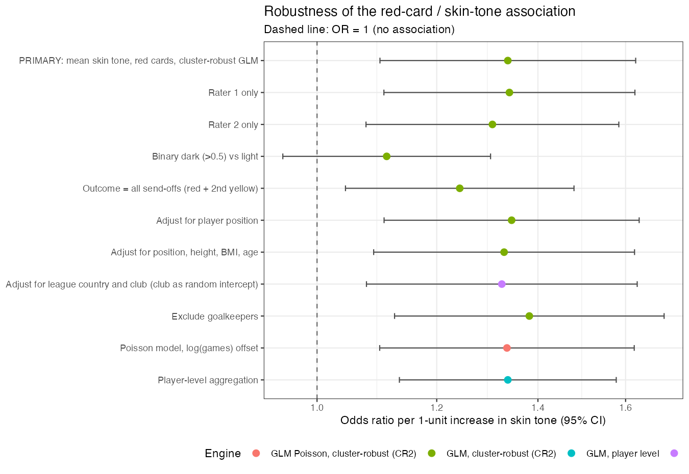
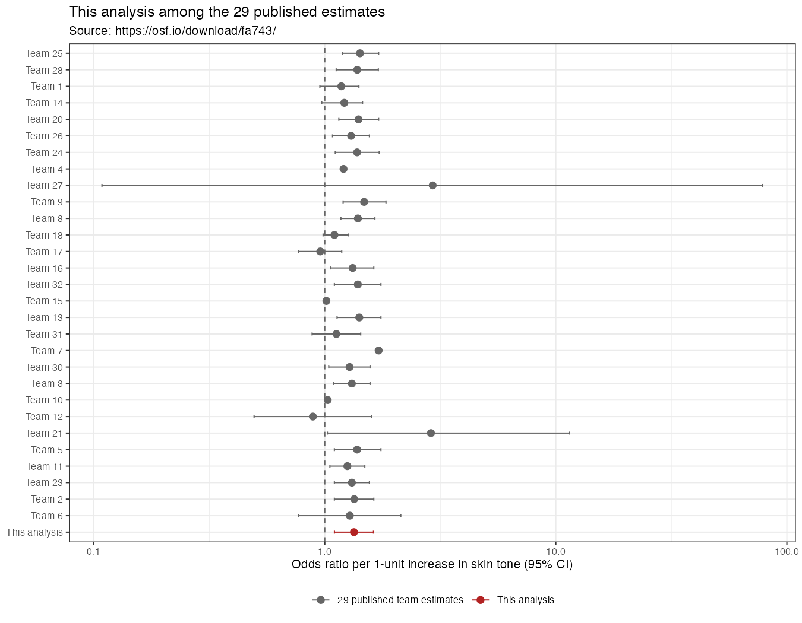

# Do referees give more red cards to dark-skin-toned players?

An independent analysis of the *many analysts, one dataset* case (Silberzahn et al.,
2018; dataset described in `README.md`). All numbers below come from `analysis.R`,
which runs from a clean start and writes `estimates.csv`, `robustness.png`,
`comparison.png` and `teams29.csv`.

## Data

146,028 player–referee dyads (2,053 players, 3,147 referees) covering 426,572
player-games in the 2012/13 first divisions of England, France, Germany and Spain.
Skin tone is rated by two people on a 0–1 scale (five levels); 21,407 dyads (468
players, all without a photo) have no rating. The two raters correlate at *r* = .92.
Red cards are rare: 1,834 direct reds (0.43% of games); adding second-yellow
dismissals brings the total to 3,496 send-offs.

The 124,621 dyads with a skin-tone rating are used for the primary analysis.

## 1. Primary analysis

**Approach.** I model red cards at the dyad level with a logistic regression in which
each player–referee pair contributes its red cards as successes out of its games
(`cbind(redCards, games - redCards)`), and skin tone enters as the average of the two
raters. Because the same player appears under many referees and the same referee
appears with many players, observations are not independent; I use standard errors
clustered by player **and** referee (two-way cluster-robust, CR2), which gives a
population-averaged odds ratio without imposing a random-effects distribution. I keep
the outcome model as a binomial for games rather than a bare proportion so that
players who played more games count proportionally more.

Model: `redCards ~ skin_tone`, binomial with `games` trials, SE clustered by
`playerShort` and `refNum`.

**Result.**

| Quantity | Estimate |
|---|---|
| Odds ratio per 1-unit increase in skin tone (lightest → darkest) | **1.337** |
| 95% confidence interval | **1.101 – 1.625** |
| *p* | .003 |

On this scale the estimate says the odds of a red card for a player rated at the
darkest point are about 34% higher than for a player rated at the lightest point.
The association is small but the confidence interval excludes 1.

## 2. Analysis decisions the question and data did not settle

1. **Skin-tone variable.** Two raters exist. I average them, treating the result as
   continuous. One could use rater 1 or rater 2 alone, or dichotomise into dark/light.
2. **Dichotomous vs continuous.** The question names "dark" and "light" groups, which
   invites a binary split, but the data are five ordinal levels and a split discards
   information.
3. **Outcome.** I use direct red cards only. Second-yellow dismissals (`yellowReds`) are
   also send-offs and could be included.
4. **Unit and exposure.** I keep dyads and use games as the binomial denominator.
   Collapsing to one row per player (career reds per career games) is equally natural.
5. **Dependence.** Repeated players and referees mean the observations are clustered.
   I use two-way cluster-robust SEs; a mixed model with random intercepts is the main
   alternative.
6. **Covariates.** The question asks for a raw comparison, but position, physical
   build and league/club could confound the association (defenders receive more reds
   and differ in skin tone by position).
7. **Sample.** Include everyone with a rating, or exclude goalkeepers (who rarely
   receive reds), or drop rarely-seen players.
8. **Missing data.** The 468 unrated players (21,407 dyads) are dropped. Whether to
   impute, keep as a category, or accept complete cases is undetermined by the data.

## 3. Robustness

Ten alternative choices, each defensible, were specified before running. My prior
expectation is noted below; I expected the covariate adjustments and the binary split
to be the most likely to move the interval across 1.

| # | Alternative choice | OR | 95% CI | CI excludes 1? | Expected to change conclusion? |
|---|---|---|---|---|---|
| — | **Primary** | **1.34** | 1.10 – 1.62 | yes | — |
| 1 | Rater 1 only | 1.34 | 1.11 – 1.62 | yes | no |
| 2 | Rater 2 only | 1.31 | 1.08 – 1.58 | yes | no |
| 3 | Binary dark (>0.5) vs light | 1.11 | 0.95 – 1.30 | **no** | yes — wider interval |
| 4 | Outcome = all send-offs | 1.24 | 1.04 – 1.48 | yes | slightly weaker |
| 5 | Adjust for position | 1.35 | 1.11 – 1.63 | yes | possibly |
| 6 | Adjust for position, height, BMI, age | 1.33 | 1.09 – 1.62 | yes | possibly |
| 7 | Adjust for league country and club | 1.33 | 1.08 – 1.63 | yes | possibly |
| 8 | Exclude goalkeepers | 1.38 | 1.13 – 1.70 | yes | no |
| 9 | Poisson model, log(games) offset | 1.34 | 1.10 – 1.62 | yes | no |
| 10 | Player-level aggregation | 1.34 | 1.13 – 1.58 | yes | no |

**What changed the conclusion.** Only the binary split (choice 3) moved the interval
across 1: dark-vs-light gives OR = 1.11 (0.95–1.30). The other nine choices leave a
small positive association whose interval excludes 1, with point estimates between
1.24 and 1.38. Two features of the result worth naming:

- **Adjustment does not explain the association.** Position, physical build and
  league/club leave the estimate essentially unchanged, so the crude association is
  not an artifact of defenders or specific leagues.
- **The player-level model returns exactly the primary point estimate** (1.3374). This
  is not a coincidence: skin tone is constant within a player, so aggregating dyads to
  players leaves the maximum-likelihood estimate unchanged; only the standard error
  changes. The dyadic structure therefore matters for inference, not for the point
  estimate.

## 4. Where this estimate falls among the 29 teams

I downloaded the 29 teams' estimates from `https://osf.io/download/fa743/` (opened in
this session) only after completing steps 1–3. The file reports each team's analytic
approach, its estimate on its native scale, and a harmonised odds ratio.

Summaries computed from that file:

- Median OR = 1.31, mean OR = 1.39.
- Range: 0.89 (Team 12, zero-inflated Poisson) to 2.93 (Team 27, Poisson, with a
  confidence interval from 0.11 to 78.7).
- 20 of the 29 teams report a 95% interval that excludes 1.

My estimate (OR = 1.34, CI 1.10–1.62) sits in the dense cluster just above the
median: 16 of the 29 team estimates are below it (roughly the 57th percentile of the
30 estimates including mine). It is almost identical to Team 2's harmonised estimate
(OR = 1.34, CI 1.10–1.63, a linear probability model / logistic regression) and to
several multilevel logistic specifications (Teams 24, 28).

## 5. Conclusion

Using a dyad-level logistic regression with standard errors clustered by player and
referee, darker-skinned players receive red cards at a modestly higher rate
(OR = 1.34, 95% CI 1.10–1.62). The estimate is stable across nine of ten alternative
analytic choices and lands squarely inside the cluster of published team estimates,
but collapsing skin tone to a dark/light split removes the association (OR = 1.11,
0.95–1.30), so the evidence is sensitive to how the predictor is operationalised and
should be read as a small, specification-dependent association rather than a robust
effect.
